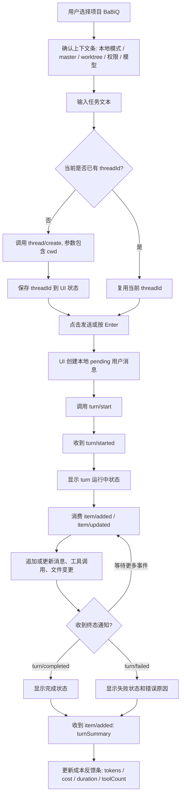

# 01 发送消息与 TurnSummary 流程

## 目标

用户在输入框中确认上下文后发送任务。桌面端创建或复用 thread,调用 `turn/start`,随后消费后端推送的 `turn/started`、`item/added`、`item/updated`、`item/completed`、`turn/completed`、`turn/failed` 和 `turnSummary`。

## 主流程

## 桌面端状态

| 状态 | UI 表现 | 允许操作 |
| --- | --- | --- |
| `idle` | 输入框可编辑,发送按钮可用 | 输入、切换模型、切换上下文 |
| `sending` | 用户消息进入 pending 状态 | 禁止重复发送同一条消息 |
| `running` | 消息流持续更新,可显示停止按钮 | 允许 `turn/interrupt` |
| `waitingApproval` | 弹出审批弹窗 | 仅允许审批相关操作 |
| `completed` | 显示 TurnSummary 成本反馈 | 可继续下一轮 |
| `failed` | 显示错误卡片和重试入口 | 可复制错误、重新发送 |

## 关键约束

- 输入框上下文条的值要随 `turn/start` 一起固化到本轮 UI 快照中,不要在运行中被后续切换影响。
- `turnSummary` 是普通 `item/added` 的一种,类型为 `turnSummary`;桌面端不要另建私有协议。
- P1 阶段可以先按完整 item 替换更新,后续再优化 token 级细粒度渲染。
