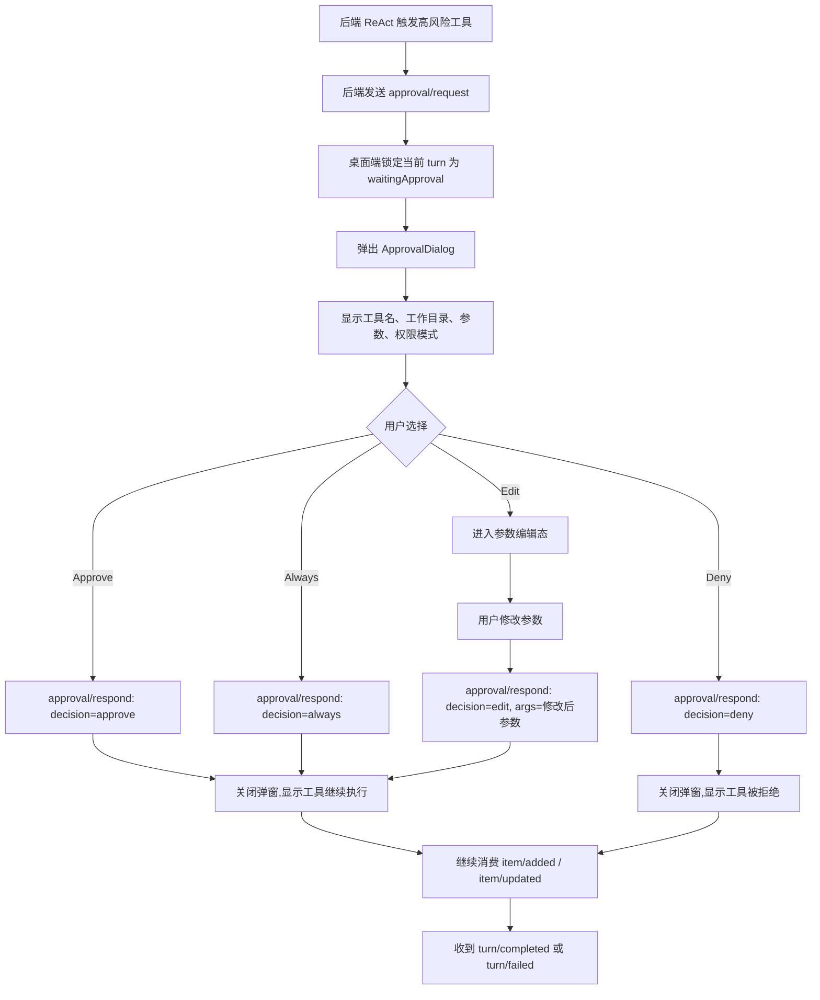
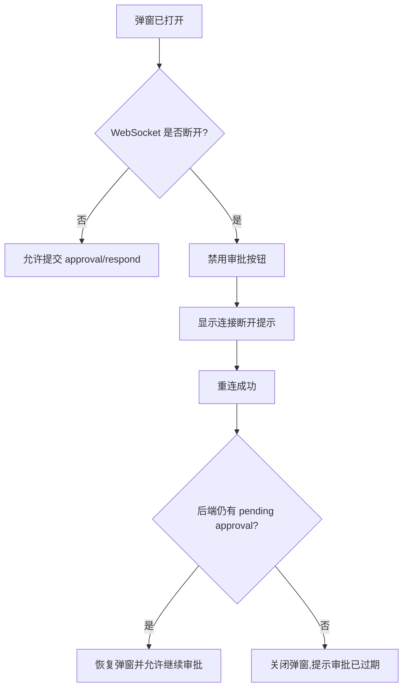

# 02 工具审批流程

## 目标

当后端因为 HITL 触发 `approval/request` 时,桌面端弹出审批弹窗。用户可以 Approve、Deny、Always 或 Edit,桌面端调用 `approval/respond` 回写决策。

## 主流程

## 弹窗内容

| 区域 | 内容 |
| --- | --- |
| 标题 | `需要审批工具调用` |
| 风险标签 | 当前权限策略,例如 `on-request` 或 `完全访问权限` |
| 上下文标签 | 项目、cwd、分支、worktree |
| 工具信息 | tool name、命令或参数 JSON |
| 操作按钮 | `Deny`、`Edit`、`Always`、`Approve` |

## 异常流程

## 关键约束

- `approval/request` 的 `itemId`、`threadId`、`turnId` 必须原样保留,供 `approval/respond` 使用。
- `Edit` 只允许编辑后端暴露的工具参数;P1 不做任意脚本编辑器。
- 如果审批提交失败,弹窗不直接消失,要显示错误并允许用户重试或取消。
