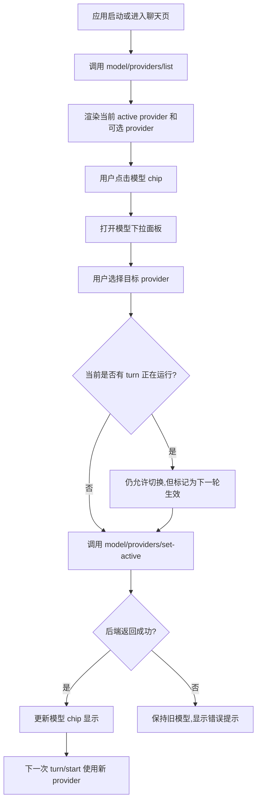

# 03 Provider 与模型切换流程

## 目标

模型切换入口放在输入框右侧的上下文条里。用户选择模型后,桌面端调用 `model/providers/set-active`,并明确提示“从下一条消息开始生效”。

## 主流程

## UI 状态

| 状态 | UI 表现 |
| --- | --- |
| `loadingProviders` | 模型 chip 显示加载状态 |
| `ready` | 显示 `providerId · model` |
| `switching` | 下拉项显示切换中 |
| `switchFailed` | 保留旧值并显示错误 |

## 关键约束

- 模型切换不影响已经开始的 turn。
- P1 阶段设置页只读;新增、编辑、删除 provider 不在 P1-4 范围。
- 下拉面板应靠近输入框模型 chip,不要放回顶部大入口。
