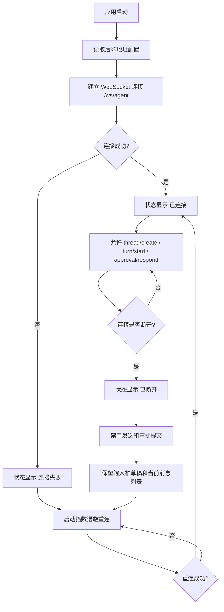

# 04 连接与重连流程

## 目标

桌面端启动后连接后端 `/ws/agent`。连接断开时,聊天历史仍可查看,输入草稿保留,发送和审批提交暂时禁用,并自动重连。

## 主流程

## 断线时的 UI 行为

| 区域 | 行为 |
| --- | --- |
| 输入框 | 草稿保留,发送按钮禁用 |
| 审批弹窗 | 按钮禁用,显示“连接恢复后继续” |
| 顶部或底部状态 | 显示断线和重连中 |
| 消息列表 | 不清空,保持最后已知状态 |
| Provider 下拉 | 禁用切换或显示只读 |

## 关键约束

- P1 不做复杂离线队列;断线期间不自动发送新任务。
- 如果断线发生在 turn 运行中,UI 标为“状态未知”,重连后再等待后端后续事件;如果后端没有补发能力,允许用户手动重试。
- 重连失败要有明确提示,不能静默卡住。
