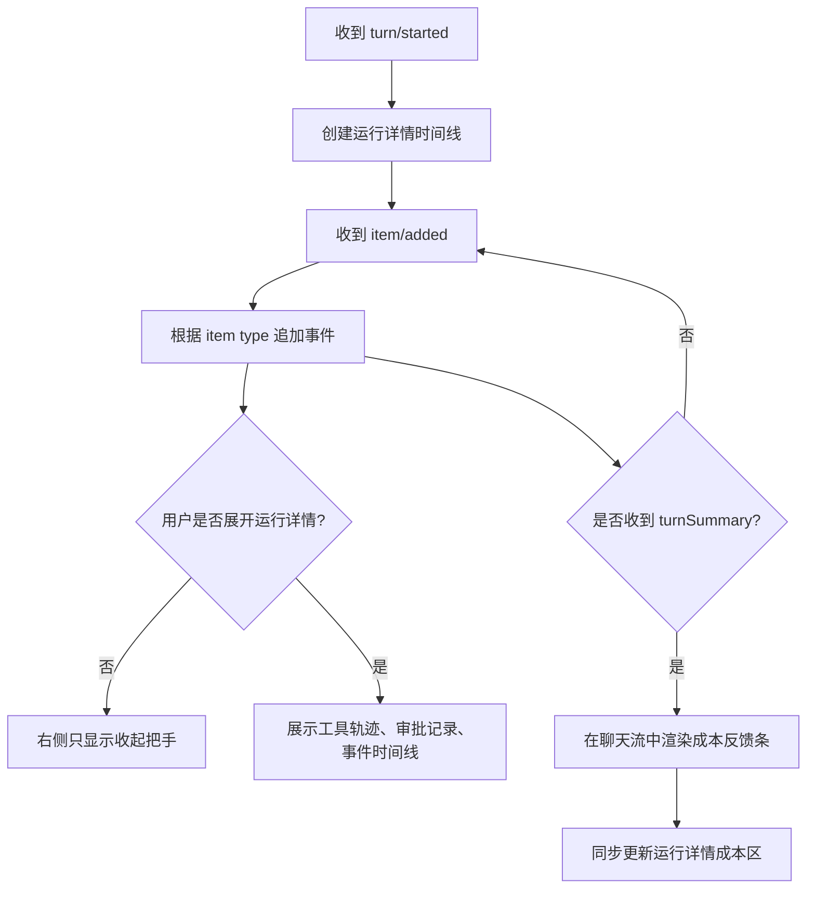
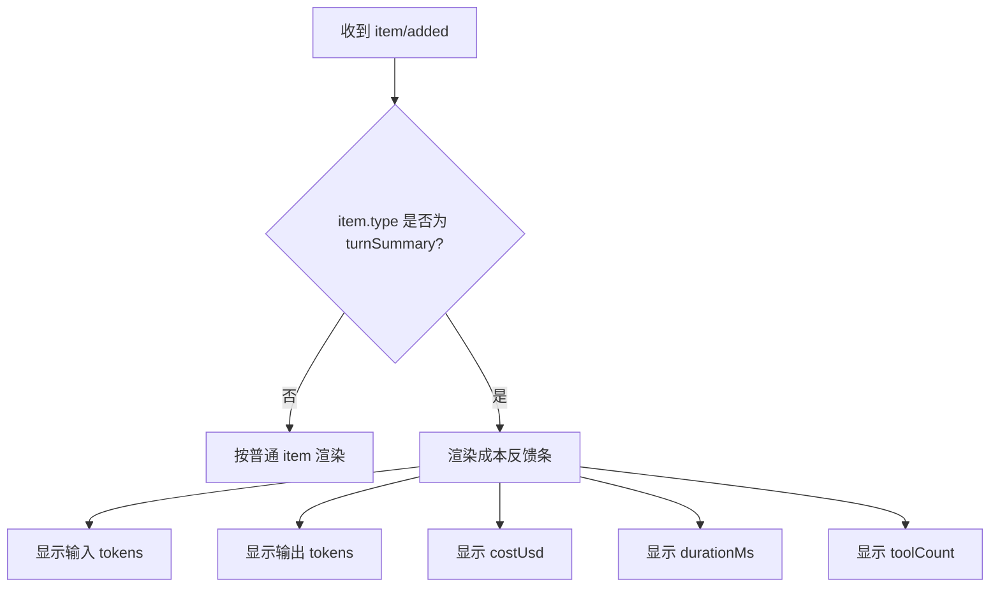

# 05 运行详情与成本反馈流程

## 目标

默认保持聊天界面清爽,右侧运行详情收起。用户需要查看时展开,看到当前 turn 的工具轨迹、事件流和成本明细。TurnSummary 成本反馈条始终在聊天流中可见。

## 主流程

## 运行详情内容

| 模块 | 内容 |
| --- | --- |
| 事件时间线 | `turn/started`、`item/added`、`approval/request`、`turn/completed` |
| 工具轨迹 | 工具名、状态、耗时、输出摘要 |
| 审批记录 | 决策类型、操作者动作、时间 |
| 成本信息 | tokensIn、tokensOut、costUsd、durationMs、toolCount |
| 错误信息 | `turn/failed` 的错误摘要 |

## TurnSummary 展示规则

## 关键约束

- 成本反馈条来自后端 `turnSummary`,桌面端不自行估算 tokens 或价格。
- 右侧详情默认收起,避免抢占聊天主空间。
- 错误和 interrupted turn 也要显示 summary,只要后端发送了 `turnSummary`。
