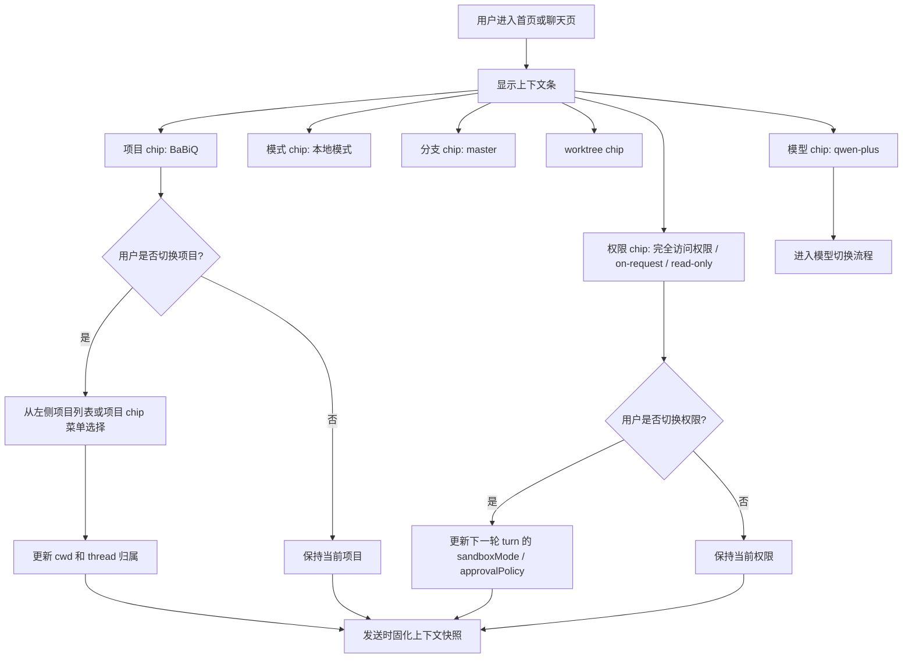

# 06 工作区上下文条流程

## 目标

输入框下方的上下文条是本轮任务的执行边界。它替代独立的“文件上下文”页面,用于让用户在发送前确认项目、运行模式、分支、worktree、权限和模型。上下文条不展示成本信息。

## 主流程

## 上下文项定义

| Chip | 作用 | P1-4 行为 |
| --- | --- | --- |
| 项目 | 决定 cwd 和 thread 归属 | 可从已有项目中切换 |
| 模式 | 本地 / 后续远程执行模式 | P1 默认本地模式 |
| 分支 | 当前 Git branch | P1 可只读展示 |
| worktree | 是否在工作树隔离运行 | P1 可只读展示 |
| 权限 | 沙箱和审批策略 | 可切换预设,影响下一轮 turn |
| 模型 | Provider / model | 可切换,影响下一轮 turn |

## 关键约束

- 上下文条是“发送前确认区”,不是独立页面。
- 上下文条只展示发送前可确认或可切换的执行上下文,不显示 `turnSummary` 成本。
- 首页/idle 状态没有本轮成本,不能显示“本轮约”成本 chip。
- 正在运行的 turn 使用开始时的上下文快照;运行中切换只影响下一轮。
- P1 不做复杂文件选择器和多文件 pinning;如果后续要做,应进入 P2 或单独计划。
