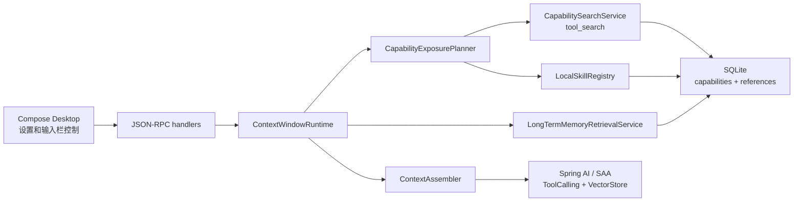

# P3-5 按需能力装配、记忆检索增强和桌面控制实施计划

> **For agentic workers:** REQUIRED: Use `superpowers:executing-plans` to execute this plan. Stop at every review checkpoint and report real verification output. Use `superpowers:test-driven-development` before writing production code, and use `superpowers:verification-before-completion` before claiming completion.
>
> **Status:** 已按用户确认执行并进入收口。本阶段保持 Spring AI `1.1.6` 不升级，采用 BaBiQ 自有能力目录、`tool_search`、长期记忆检索审计和桌面控制完成实现。

**Goal:** 在 P3-4 长期记忆异步流水线之上，把 BaBiQ 从“能注入长期记忆 summary”推进到“能按需装配工具、MCP、Skill 和记忆检索片段”的通用 Agent 平台。模型每轮只看到必要能力和必要记忆，所有能力选择、记忆检索、权限策略和审计仍以 BaBiQ 的 SQLite、JSON-RPC、沙箱、审批和 ContextSnapshot 为事实源。

**Architecture:** P3-5 新增 `capability` 与 `retrieval` 两条主线。`capability` 负责收集本地工具、MCP 工具、Skill 元数据，决定本轮哪些工具直接暴露、哪些延迟暴露、哪些禁用；`retrieval` 负责在长期记忆 artifact 和 candidate 中检索少量高相关片段，带引用注入 `long_term_memory` 层。Spring AI / Spring AI Alibaba 继续提供模型、工具调用、advisor、agent-framework 和 VectorStore 抽象，BaBiQ 负责跨模型策略、权限、审计、恢复和桌面控制。

**Tech Stack:** Java 21, Spring Boot 3.5.14, Spring AI 1.1.6, Spring AI Alibaba 1.1.2.3, Spring AI Community `tool-search-tool` / `tool-searcher-lucene` 1.0.x 可选评估, Spring AI `SimpleVectorStore` / `QuestionAnswerAdvisor` / `VectorStoreChatMemoryAdvisor`, SQLite, MyBatis-Plus, Flyway, Jackson, Kotlin Compose Desktop.

---

## 1. 证据和设计结论

### 1.1 Spring AI / Spring AI Alibaba 版本结论

- 当前仓库锁定 Spring AI `1.1.6`、Spring AI Alibaba `1.1.2.3`、Spring Boot `3.5.14`。
- Spring AI 官方 BOM 虽然已有 `1.1.7` 稳定版，但 P3-5 暂不需要为了本阶段目标升级；当前主线继续保持 `1.1.6`。
- Spring AI Alibaba `1.1.2.3` 自身 BOM 不直接托管所有 Spring AI 模块版本，当前仓库已经通过 Spring AI BOM 把最终解析版本统一到 `1.1.6`。
- Spring AI Core `1.1.6` jar 内没有 `ToolSearchToolCallAdvisor` 或 `ToolSearcher`；Dynamic Tool Search 来自 Spring AI Community 项目。
- Spring AI Community Dynamic Tool Search 的 `1.0.x` 线对应 Spring AI `1.1.x` + Spring Boot 3；P3-5a 已在当前 `1.1.6` 主线下接入 `tool-searcher-lucene:1.0.1`，只复用 Lucene 搜索器，不接入 Advisor。
- Spring AI `spring-ai-vector-store:1.1.6` 已包含 `SimpleVectorStore`、`VectorStore`、`VectorStoreRetriever`；`spring-ai-advisors-vector-store:1.1.6` 已包含 `QuestionAnswerAdvisor`、`VectorStoreChatMemoryAdvisor`。

### 1.2 Codex 源码结论

- Codex 把“工具注册表”和“模型可见工具列表”分开管理。工具可以注册但延迟暴露，模型先看到 `tool_search`，搜索命中后才加载对应工具 spec。
- Codex 的 Dynamic Tools 要求 deferred tool 带 `search_info`，并且通过 BM25 搜索返回 `LoadableToolSpec`，避免所有工具 schema 一次性塞进 prompt。
- Codex 的 Skill 注入分两步：先通过 metadata 和触发规则判断是否命中，再加载具体 `SKILL.md` 正文；Skill 正文不应该常驻每轮上下文。
- Codex 的长期记忆 read path 默认只注入压缩后的 summary，不把完整记忆仓库塞进模型。检索增强应作为 P3-5 的有界补充，而不是绕过 P3-4 的 summary-only 边界。

### 1.3 BaBiQ 设计结论

- 不能让 Spring AI Community `ToolSearchToolCallAdvisor` 直接绕过 BaBiQ 的 `ToolRegistry`、HITL 审批、沙箱、MCP 观测和 SQLite 审计。
- P3-5a 已复用 Spring AI Community 的 Lucene/BM25 搜索器，并封装成 BaBiQ `CapabilitySearchService` 默认实现。
- 工具 schema 仍走 Spring AI/SAA tool-calling 通道，能力目录摘要走 `ContextEnvelope.capability_catalog` 层，二者不能混成一个大 JSON。
- 记忆检索片段必须带 artifact/candidate/reference id、置信度、token 预算和污染标记；只能作为参考层注入，不能覆盖本轮用户输入。

---

## 2. 范围边界

### 2.1 本阶段要做

- 保持 Spring AI `1.1.6`，评估 Spring AI Community Dynamic Tool Search `1.0.x` 是否值得作为可选依赖接入。
- 建立 BaBiQ 能力目录持久化模型，覆盖 local tool、MCP tool、Skill metadata。
- 实现按需能力装配：默认工具、延迟工具、禁用工具、搜索命中工具都要写入 `ContextSnapshot` 审计。
- 实现 BaBiQ 自有 `tool_search` 工具或等价入口，确保搜索行为仍经过 ToolRegistry、审批、沙箱和运行记录。
- 建立 Skill 最小注册表，只读取本地受控 skill 目录的 metadata 和 `SKILL.md`，不做插件市场。
- 增强长期记忆检索：默认 lexical/Lucene 可用；有 embedding provider 时可启用 Spring AI `VectorStore` 检索。
- 把高相关记忆片段按预算注入 `long_term_memory` 层，并在 `bq_memory_references` 或新增检索审计表中记录来源。
- 桌面端增加能力装配、Skill、记忆检索状态和开关的最小控制。

### 2.2 本阶段不做

- 不升级到 Spring AI 2 / Spring Boot 4。
- 不把 Spring AI Alibaba 作为“Spring AI 全能力替代品”；它继续是 Alibaba 生态和 agent-framework 的增强层。
- 不绕过现有审批、沙箱、工具观测、MCP 观测和 TurnSummary。
- 不实现完整插件市场、远程 Skill 安装、OAuth MCP、远程 MCP 编辑器。
- 不把完整 `MEMORY.md` 或完整 Skill 正文常驻注入每轮 prompt。
- 不做 Multi-Agent、OS 级沙箱、多模态和 A2A。

---

## 3. 目标架构



核心原则：

- `current_turn` 最高优先级，历史、Skill、MCP、记忆都只是参考。
- `CapabilityExposurePlanner` 只决定“本轮暴露什么能力”，不直接执行能力。
- `tool_search` 只搜索和建议能力，实际工具调用仍走现有 `ToolRegistry`。
- `LongTermMemoryRetrievalService` 只返回少量引用片段，不能修改长期记忆事实源。
- 所有自动选择都要能从 `ContextSnapshot`、能力搜索事件和记忆引用记录中复现。

---

## 4. 数据模型

新增或扩展的 migration 暂定为 `V11__capability_retrieval_control.sql`。所有表和字段必须有 SQL 中文注释、`bq_schema_comments`、Entity 中文字段注释和覆盖测试。

### 4.1 `bq_capabilities`

记录 BaBiQ 已知能力。

关键字段：

- `capability_id`: 稳定能力 id，例如 `local.exec_shell`、`mcp.filesystem.read_text_file`、`skill.superpowers.test_driven_development`。
- `type`: `LOCAL_TOOL`、`MCP_TOOL`、`SKILL`。
- `namespace`: 能力命名空间，用于避免和 Codex 一样的保留命名冲突。
- `name`: 工具或 skill 名称。
- `display_name`: 桌面端展示名称。
- `description`: 给模型和用户看的短说明。
- `source_id`: MCP server id、skill directory id 或 local source。
- `schema_hash`: 工具 schema 或 Skill 正文 hash，用于识别变更。
- `search_text`: 搜索索引文本，包含名称、描述、标签，不包含敏感参数值。
- `exposure_mode`: `VISIBLE`、`DEFERRED`、`DISABLED`。
- `enabled`: 用户是否启用。
- `last_seen_at`: 最近一次扫描发现时间。

### 4.2 `bq_capability_search_events`

记录每次能力搜索和装配决策。

关键字段：

- `event_id`: 搜索事件 id。
- `thread_id` / `turn_id`: 来源会话和 turn。
- `query_text`: 搜索词或模型请求。
- `strategy`: `LUCENE` 为当前默认策略；旧库里可能保留历史 `FALLBACK_LEXICAL` 审计值，但生产代码不再写入该值。
- `result_count`: 返回候选数量。
- `selected_capability_ids_json`: 最终装配的能力 id 列表。
- `rejected_capability_ids_json`: 被拒绝或禁用的能力 id 列表。
- `created_at`: 创建时间。

### 4.3 `bq_memory_retrieval_events`

记录长期记忆检索注入过程。

关键字段：

- `retrieval_id`: 检索事件 id。
- `thread_id` / `turn_id`: 来源会话和 turn。
- `query_text`: 从本轮用户输入和上下文摘要生成的检索查询。
- `strategy`: `LEXICAL`、`VECTOR_STORE`、`HYBRID`。
- `candidate_count`: 候选数量。
- `selected_references_json`: 被注入的 artifact/candidate/reference id。
- `token_estimate`: 注入片段估算 token。
- `pollution_flags_json`: 污染或低可信标记。
- `created_at`: 创建时间。

---

## 5. 实施步骤

### Task 1: 能力搜索依赖边界确认

**目标:** 保持 Spring AI `1.1.6` 不升级，只确认 Spring AI Community Dynamic Tool Search `1.0.x` 是否能在当前主线上作为可选能力搜索实现使用。P3-5a 已确认并接入 `tool-searcher-lucene:1.0.1`，只把 LuceneToolSearcher 作为 `CapabilitySearchService` 的底层实现。

文件：

- `backend/pom.xml`（仅在确认可安全接入 Spring AI Community 依赖时修改）

步骤：

1. 保持 `spring-ai.version=1.1.6` 不变。
2. 先用临时 Maven 参数或隔离分支验证 `org.springaicommunity` `1.0.x` 是否能与当前依赖树编译通过。
3. 如果验证通过，再新增属性 `spring-ai-community-tool-search.version=1.0.1` 和可选依赖：
   - `org.springaicommunity:tool-search-tool`
   - `org.springaicommunity:tool-searcher-lucene`
4. P3-5a 验证通过后，后续能力搜索统一使用 `LuceneCapabilitySearchService`，不再保留 fallback 实现。
5. 跑依赖树确认所有 `org.springframework.ai` 仍最终解析到 `1.1.6`。

验证：

```powershell
cd backend
.\mvnw.cmd dependency:tree "-Dincludes=org.springframework.ai,org.springaicommunity"
.\mvnw.cmd "-DskipTests" compile
.\mvnw.cmd clean verify
```

提交建议：

```text
chore(p3-5): 确认能力搜索依赖边界
```

### Task 2: 能力目录持久化底座

**目标:** 建立 `bq_capabilities`、`bq_capability_search_events`、`bq_memory_retrieval_events`，并提供 repository adapter。

新增文件：

- `backend/src/main/resources/db/migration/V11__capability_retrieval_control.sql`
- `backend/src/main/java/com/wzx/babiq/server/capability/CapabilityEntity.java`
- `backend/src/main/java/com/wzx/babiq/server/capability/CapabilitySearchEventEntity.java`
- `backend/src/main/java/com/wzx/babiq/server/memory/retrieval/MemoryRetrievalEventEntity.java`
- `backend/src/main/java/com/wzx/babiq/server/capability/CapabilityRepository.java`
- `backend/src/main/java/com/wzx/babiq/server/capability/MyBatisCapabilityRepository.java`

测试：

- `backend/src/test/java/com/wzx/babiq/server/capability/CapabilityRepositoryTest.java`
- 扩展 `backend/src/test/java/com/wzx/babiq/server/persistence/SchemaCommentsCoverageTest.java`

验证：

```powershell
cd backend
.\mvnw.cmd "-Dtest=SchemaCommentsCoverageTest,CapabilityRepositoryTest" test
```

提交建议：

```text
feat(p3-5): 建立能力目录持久化底座
```

### Task 3: 能力扫描和目录装配

**目标:** 从现有 local tool、MCP tool、Skill metadata 生成统一能力目录，记录 VISIBLE/DEFERRED/DISABLED。

新增文件：

- `backend/src/main/java/com/wzx/babiq/server/capability/CapabilityType.java`
- `backend/src/main/java/com/wzx/babiq/server/capability/CapabilityExposureMode.java`
- `backend/src/main/java/com/wzx/babiq/server/capability/CapabilityDescriptor.java`
- `backend/src/main/java/com/wzx/babiq/server/capability/CapabilityCatalogSyncService.java`
- `backend/src/main/java/com/wzx/babiq/server/capability/CapabilityCatalogService.java`

修改文件：

- `backend/src/main/java/com/wzx/babiq/server/context/CapabilityCatalogAssembler.java`
- `backend/src/main/java/com/wzx/babiq/server/tool/ToolRegistry.java`
- `backend/src/main/java/com/wzx/babiq/server/mcp/McpToolCatalog.java`

设计要求：

- local tool 和 MCP tool 都只收集 schema hash，不把完整 schema 放进 context envelope。
- MCP server 刷新后同步能力目录。
- 禁用能力不进入模型可见列表，也不被 `tool_search` 返回。
- 能力目录摘要继续限制 token，避免 P3-1 的能力目录膨胀。

测试：

- `CapabilityCatalogSyncServiceTest`
- `CapabilityCatalogAssemblerTest`
- `McpToolCatalogCapabilityTest`

验证：

```powershell
cd backend
.\mvnw.cmd "-Dtest=CapabilityCatalogSyncServiceTest,CapabilityCatalogAssemblerTest,McpToolCatalogCapabilityTest" test
```

提交建议：

```text
feat(p3-5): 同步本地和 MCP 能力目录
```

### Task 4: 按需工具暴露和 `tool_search`

**目标:** 实现 Codex 风格的 deferred tool 机制。模型默认只看到核心工具和 `tool_search`；搜索命中后，本轮或下一次 agent 迭代可以装配命中的工具。

新增文件：

- `backend/src/main/java/com/wzx/babiq/server/capability/CapabilityExposurePlanner.java`
- `backend/src/main/java/com/wzx/babiq/server/capability/CapabilityExposurePlan.java`
- `backend/src/main/java/com/wzx/babiq/server/capability/CapabilitySearchService.java`
- `backend/src/main/java/com/wzx/babiq/server/capability/LuceneCapabilitySearchService.java`
- `backend/src/main/java/com/wzx/babiq/server/tool/impl/ToolSearchTool.java`

修改文件：

- `backend/src/main/java/com/wzx/babiq/server/agent/AgentLoop.java`
- `backend/src/main/java/com/wzx/babiq/server/context/runtime/ContextWindowRuntime.java`
- `backend/src/main/java/com/wzx/babiq/server/context/model/ContextSnapshot.java`
- `backend/src/main/java/com/wzx/babiq/server/tool/ToolRegistry.java`

设计要求：

- `CapabilityExposurePlanner` 在每轮开始前输出：
  - `visibleToolIds`
  - `deferredToolIds`
  - `disabledToolIds`
  - `reason`
- `ToolSearchTool` 是普通 BaBiQ 工具，继续经过审批、沙箱、Spotlighting 和工具记录。
- 如果 ReactAgent/SAA 当前迭代无法动态增量添加工具，则 P3-5 先实现“搜索结果进入下一次模型调用”的保守路径，并在 handoff 中记录限制。
- 搜索结果必须落 `bq_capability_search_events`。

测试：

- `CapabilityExposurePlannerTest`
- `LuceneCapabilitySearchServiceTest`
- `CapabilityCatalogSyncServiceTest`
- `ToolSearchToolTest`
- `AgentLoopCapabilityExposureTest`

验证：

```powershell
cd backend
.\mvnw.cmd "-Dtest=CapabilityExposurePlannerTest,LuceneCapabilitySearchServiceTest,CapabilityCatalogSyncServiceTest,ToolSearchToolTest,AgentLoopCapabilityExposureTest" test
```

提交建议：

```text
feat(p3-5): 实现按需工具搜索和暴露
```

### Task 5: Skill 最小注册表

**目标:** 把本地 Skill 作为能力目录的一类 metadata，支持按需加载 `SKILL.md` 正文。

新增文件：

- `backend/src/main/java/com/wzx/babiq/server/skill/SkillProperties.java`
- `backend/src/main/java/com/wzx/babiq/server/skill/SkillDescriptor.java`
- `backend/src/main/java/com/wzx/babiq/server/skill/LocalSkillRegistry.java`
- `backend/src/main/java/com/wzx/babiq/server/skill/SkillContentLoader.java`

新增 JSON-RPC：

- `skills/list`
- `skills/get`

设计要求：

- 默认只读取配置允许的本地目录。
- `skills/list` 返回 metadata，不返回完整正文。
- `skills/get` 返回单个 Skill 正文，并记录加载事件。
- Skill 正文进入 context 时必须标记为 developer/contextual 层，不能写入用户历史 item。

测试：

- `LocalSkillRegistryTest`
- `SkillHandlersTest`
- `ContextAssemblerSkillInjectionTest`

验证：

```powershell
cd backend
.\mvnw.cmd "-Dtest=LocalSkillRegistryTest,SkillHandlersTest,ContextAssemblerSkillInjectionTest" test
```

提交建议：

```text
feat(p3-5): 接入本地 Skill 按需加载
```

### Task 6: 长期记忆检索增强

**目标:** 在 P3-4 summary read path 之外，增加少量高相关长期记忆片段检索。默认 lexical/Lucene 可用；有 embedding provider 时启用 Spring AI VectorStore。

新增文件：

- `backend/src/main/java/com/wzx/babiq/server/memory/retrieval/LongTermMemoryRetrievalService.java`
- `backend/src/main/java/com/wzx/babiq/server/memory/retrieval/MemoryRetrievalStrategy.java`
- `backend/src/main/java/com/wzx/babiq/server/memory/retrieval/LexicalMemoryRetrievalStrategy.java`
- `backend/src/main/java/com/wzx/babiq/server/memory/retrieval/SpringAiVectorMemoryRetrievalStrategy.java`
- `backend/src/main/java/com/wzx/babiq/server/memory/retrieval/MemoryRetrievalSettings.java`

修改文件：

- `backend/src/main/java/com/wzx/babiq/server/memory/LongTermMemoryReadService.java`
- `backend/src/main/java/com/wzx/babiq/server/context/ContextAssembler.java`
- `backend/src/main/java/com/wzx/babiq/server/context/runtime/ContextWindowRuntime.java`

设计要求：

- `memory_summary` 仍是默认 read path 主体。
- 检索片段默认上限 3 条，总预算默认不超过当前模型窗口的 5%，且受全局 context budget 约束。
- `SECRET_RISK`、污染标记或用户禁用的记忆不得注入。
- 每条注入片段必须带 source id 和 confidence。
- 检索事件写入 `bq_memory_retrieval_events`，注入引用写入 `bq_memory_references`。

测试：

- `LongTermMemoryRetrievalServiceTest`
- `LexicalMemoryRetrievalStrategyTest`
- `SpringAiVectorMemoryRetrievalStrategyTest`
- `ContextAssemblerMemoryRetrievalTest`

验证：

```powershell
cd backend
.\mvnw.cmd "-Dtest=LongTermMemoryRetrievalServiceTest,LexicalMemoryRetrievalStrategyTest,SpringAiVectorMemoryRetrievalStrategyTest,ContextAssemblerMemoryRetrievalTest" test
```

提交建议：

```text
feat(p3-5): 增强长期记忆检索注入
```

### Task 7: JSON-RPC 和桌面控制

**目标:** 桌面端能看到当前能力装配、Skill、记忆检索状态，并能切换关键设置。

新增后端 handler：

- `capability/status`
- `capability/search`
- `capability/settings/set`
- `skills/list`
- `skills/get`
- `memory/search`

后端文件：

- `backend/src/main/java/com/wzx/babiq/server/api/method/CapabilityStatusHandler.java`
- `backend/src/main/java/com/wzx/babiq/server/api/method/CapabilitySearchHandler.java`
- `backend/src/main/java/com/wzx/babiq/server/api/method/CapabilitySettingsSetHandler.java`
- `backend/src/main/java/com/wzx/babiq/server/api/method/SkillsListHandler.java`
- `backend/src/main/java/com/wzx/babiq/server/api/method/SkillsGetHandler.java`
- `backend/src/main/java/com/wzx/babiq/server/api/method/MemorySearchHandler.java`

桌面文件：

- `desktop/src/main/kotlin/com/wzx/babiq/desktop/protocol/CapabilityModels.kt`
- `desktop/src/main/kotlin/com/wzx/babiq/desktop/protocol/SkillModels.kt`
- `desktop/src/main/kotlin/com/wzx/babiq/desktop/protocol/AgentClient.kt`
- `desktop/src/main/kotlin/com/wzx/babiq/desktop/state/ChatController.kt`
- `desktop/src/main/kotlin/com/wzx/babiq/desktop/ui/chat/ComposerContextBar.kt`
- `desktop/src/main/kotlin/com/wzx/babiq/desktop/ui/settings/SettingsPanel.kt`

设计要求：

- 输入栏 chip 显示“能力按需”“长期记忆检索”等状态，但不展示大段解释文字。
- 设置页允许切换：能力按需装配、Skill 启用、记忆检索启用、向量检索启用。
- 所有设置写入后端真实配置，不只是 UI 状态。

测试：

- 后端 `CapabilityHandlersTest`、`SkillHandlersTest`、`MemoryHandlersTest`
- 桌面 `CapabilityModelsTest`、`SkillModelsTest`、`AgentClientTest`、`ChatControllerTest`、`ComposerContextBarTest`

验证：

```powershell
cd backend
.\mvnw.cmd "-Dtest=CapabilityHandlersTest,SkillHandlersTest,MemoryHandlersTest" test

cd ..\desktop
.\gradlew.bat test --tests "*CapabilityModelsTest" --tests "*SkillModelsTest" --tests "*AgentClientTest" --tests "*ChatControllerTest" --tests "*ComposerContextBarTest"
```

提交建议：

```text
feat(p3-5): 增加能力和记忆检索桌面控制
```

### Task 8: 文档、规则和最终验证

**目标:** 同步 P3 文档、`AGENTS.md`、`CLAUDE.md`，并执行完整验收。

修改文件：

- `docs/superpowers/plans/p3-master.md`
- `docs/superpowers/plans/p3-task-index.md`
- `docs/superpowers/plans/p3-5-capability-retrieval-control/codex-handoff.md`
- `AGENTS.md`
- `CLAUDE.md`

最终验证：

```powershell
cd backend
.\mvnw.cmd "-Dtest=SchemaCommentsCoverageTest,CapabilityRepositoryTest,CapabilityCatalogSyncServiceTest,CapabilityExposurePlannerTest,LuceneCapabilitySearchServiceTest,ToolSearchToolTest,LocalSkillRegistryTest,LongTermMemoryRetrievalServiceTest,ContextAssemblerMemoryRetrievalTest,CapabilityHandlersTest,SkillHandlersTest,MemoryHandlersTest" test
.\mvnw.cmd clean verify

cd ..\desktop
.\gradlew.bat test --tests "*CapabilityModelsTest" --tests "*SkillModelsTest" --tests "*MemoryModelsTest" --tests "*AgentClientTest" --tests "*ChatControllerTest" --tests "*ComposerContextBarTest"
.\gradlew.bat test
```

最终提交建议：

```text
docs(p3-5): 同步能力装配和记忆检索阶段状态
```

---

## 6. 风险和处理

### 6.1 避免非必要 Spring AI 升级风险

处理：

- Task 1 默认不升级 Spring AI，先保护当前 P3-4 已验证链路。
- 如果可选引入 Spring AI Community Dynamic Tool Search 后 `clean verify` 失败，立即移除该依赖，回到 BaBiQ 自有搜索实现。
- Dynamic Tool Search Advisor 不作为硬依赖贯穿核心路径；BaBiQ 保留 `CapabilitySearchService` 接口，P3-5a 已把默认实现替换为 LuceneToolSearcher，不再保留 fallback。

### 6.2 ReactAgent 当前迭代动态工具装配能力不确定

处理：

- 先用测试确认 SAA `ReactAgent` 是否允许每个模型迭代更新 tool callbacks。
- 如果不支持，本阶段实现“搜索后下一次模型调用可见”的保守路径，并在 UI/运行记录中展示。
- 不为了动态装配强行绕过 SAA 或重写 ReactAgent。

### 6.3 记忆检索污染当前任务

处理：

- 注入层明确标记为 `long_term_memory.reference`。
- System/developer prompt 明确“当前用户消息优先于长期记忆”。
- 检索片段必须带 source id、confidence 和污染标记。
- 记忆检索预算小于当前窗口 5%，并受全局 budget 约束。

### 6.4 Skill 正文膨胀上下文

处理：

- 默认只注入 Skill metadata。
- 只有命中或用户显式要求时才加载 `SKILL.md`。
- 单个 Skill 正文需要 token 上限，超限按段落边界截断，并写入 excluded reason。

---

## 7. 验收标准

P3-5 只有满足以下条件才算完成：

- 明确保持 Spring AI `1.1.6`；Spring AI Community Dynamic Tool Search `1.0.x` 只是可选候选实现，接入或不接入都有清晰记录。
- 能力目录能从 local tool、MCP tool、Skill metadata 同步，并落库审计。
- 模型可见工具列表能按 VISIBLE/DEFERRED/DISABLED 生成，`ContextSnapshot` 能复现装配决策。
- `tool_search` 不绕过 BaBiQ 工具执行链路。
- 长期记忆检索能注入少量高相关片段，且不会破坏 P3-4 的 summary read path。
- 桌面端设置能真实影响后端 Agent 行为。
- 阶段专属测试、后端 `clean verify`、桌面端 `gradlew test` 全部通过。
- `AGENTS.md` 和 `CLAUDE.md` 已同步 P3-5 完成状态和下一步。
