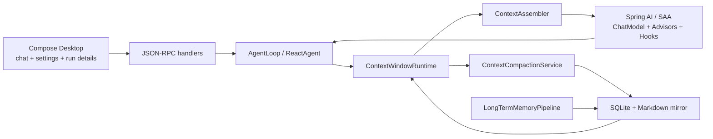

# BaBiQ P3 Context and Memory Platform Master Plan

> **For agentic workers:** REQUIRED: Use `superpowers:writing-plans` before creating or changing any P3 child plan. Use `superpowers:test-driven-development` before implementing P3 code, and use `superpowers:verification-before-completion` before claiming a P3 task is complete.
>
> **This is the P3 MASTER plan.** It defines the architecture for Codex-level current window management, short-term memory/context compaction, and long-term memory. Detailed implementation must live in child plans under `docs/superpowers/plans/p3-*/`.

**Goal:** 把 BaBiQ 从 P2 的“可持久化本地 Agent”，升级为具备 Codex 级上下文工程能力的通用 Agent 平台：能管理当前模型窗口、在窗口压力下自动压缩短期上下文、在会话外异步沉淀长期记忆，并且不绑定 GPT 或某个单一模型供应商。

**Architecture:** P3 继续沿用 Kotlin Compose Desktop + Spring Boot Agent Server + WebSocket JSON-RPC 架构。后端新增 `context` 和 `memory` 两个领域子系统：`context` 负责每轮模型可见窗口、token 预算、压缩事件和 prompt 组装；`memory` 负责短期摘要、长期记忆提取、长期记忆检索和记忆注入。Spring AI 和 Spring AI Alibaba 作为模型、工具、advisor、hook、interceptor 的基础设施，BaBiQ 自己维护跨模型的上下文策略、持久化状态和桌面协议。

**Tech Stack:** Java 21, Spring Boot 3.5.14, Spring AI 1.1.6, Spring AI Alibaba 1.1.2.3, SQLite, MyBatis-Plus, Flyway, Jackson, Spring Scheduling, Spring AI ChatMemory/Advisor/VectorStore/Structured Output, Spring AI Alibaba ReactAgent/Hook/Interceptor/MemorySaver/ContextEditing/Summarization.

---

## 1. P3 为什么要做

P2 已经完成本地持久化、会话历史、运行记录、设置系统、审批/沙箱策略和 MCP Client 最小接入。现在的缺口不是“有没有历史记录”，而是“下一轮模型到底看见哪些内容、为什么看见这些内容、上下文满了以后怎么安全收缩、跨会话经验怎么回流”。

当前 BaBiQ 已经有这些基础：

- `Thread / Turn / Item` 协议和 SQLite 持久化。
- `TurnSummary`、工具调用、审批、运行记录和本地统计。
- Provider 模型元数据里已有 `contextWindow`。
- `ThreadItem` 协议里已经存在 `ContextCompactionItem` 类型。
- Spring AI `MessageWindowChatMemory` 已接在 `ChatClientFactory` 上，但 ReactAgent 主链路仍主要依赖 Spring AI Alibaba 的 agent 状态和 BaBiQ 自己的持久化记录。

这意味着 P3 不能只把 `maxMessages` 调大或换一个 memory advisor。BaBiQ 需要一个独立的上下文运行时，把 Spring AI/SAA 能力组织成可审计、可恢复、可切模型的上下文平台。

---

## 2. Codex 实现给 BaBiQ 的设计结论

本次核对 `E:\wzx\codex` 后，Codex 的核心做法可以抽象为三层。

### 2.1 当前窗口管理

Codex 用 `ContextManager` 持有 oldest-to-newest 的模型可见 `ResponseItem` 历史，同时维护 `history_version`、token usage、reference context 等运行时状态。它不会简单把所有 transcript 原样送入模型，而是会：

- 只记录 API/model 可见 item。
- 在发送 prompt 前规范化历史，修正 tool call 和 tool result 的配对关系。
- 对不适合当前模型的多模态内容做过滤或降级。
- 按 token 使用量、窗口 generation 和 prefix baseline 判断是否接近窗口压力。

BaBiQ 对应设计：新增 `ContextWindowRuntime`，每个 turn 先生成 `ContextSnapshot`，明确本轮模型可见 item、估算 token、实际 token、模型窗口、压缩窗口 ordinal 和排除原因。

### 2.2 短期记忆和上下文压缩

Codex 的 compaction 不是聊天摘要小工具，而是运行时的一部分：

- 压缩触发可以发生在 turn 前或 turn 中。
- 压缩本身会生成 `ContextCompactionItem`，进入用户可见/可审计事件流。
- 压缩时复制当前历史，追加专门的 compaction prompt，请模型产出摘要。
- 如果压缩 prompt 仍超窗口，会先剔除最旧历史再重试。
- 压缩完成后用 summary 替换历史，并开启新的 auto compact window。
- 对最近用户消息有单独 token budget，避免压缩后完全丢掉用户近期意图。

BaBiQ 对应设计：新增 `ContextCompactionService` 和 `ContextCompactionPolicy`。默认使用通用 `ChatModel` 做 inline compaction；如果 Spring AI Alibaba 的 `ContextEditingInterceptor` 或 `SummarizationHook` 能满足场景，可作为策略实现复用。压缩结果必须落库、生成 `ContextCompactionItem`、进入运行记录，并在下一轮 prompt 组装时作为 summary message 注入。

### 2.3 长期记忆

Codex 的长期记忆是异步两阶段流水线，不是每轮即时写 `memory.md`：

- Phase 1 在 root session 启动后异步扫描可处理 rollout。
- 它按来源、时间、空闲时间、lease 状态筛选 conversation 记录。
- 模型抽取 `raw_memory`、`rollout_summary` 和可选 slug，并先做 secret redaction。
- Phase 2 获取全局锁，把多个 stage1 输出合并到 memory workspace。
- 再启动一个受限内部 agent，对 `MEMORY.md`、`memory_summary.md`、技能和 rollout summaries 做归并。
- Read path 只把受 token budget 控制的 `memory_summary.md` 注入 prompt。

BaBiQ 对应设计：新增 `LongTermMemoryPipeline`。P3 先采用 DB-first + Markdown mirror：SQLite 保存任务、stage output、记忆 artifact 元数据和引用关系；本地文件保存用户可读的 `MEMORY.md`、`memory_summary.md`、`rollout_summaries/`。读路径默认只注入短小、可信、可追溯的 memory summary，完整检索在后续阶段接 VectorStore/RAG。

---

## 3. Spring AI / Spring AI Alibaba 复用边界

P3 的原则是“复用官方组件承载能力，BaBiQ 自己掌控策略和状态”。

| 能力 | 优先复用 | BaBiQ 自己实现 |
|---|---|---|
| 模型调用 | Spring AI `ChatModel`、Spring AI Alibaba Provider 适配 | Provider capability registry、模型窗口策略、模型切换时的上下文降级 |
| 短期消息窗口 | Spring AI `ChatMemory`、`MessageWindowChatMemory`、`ChatMemoryRepository` | ReactAgent 主链路的模型可见 item 选择、token budget、持久化 context snapshot |
| Prompt 注入 | Spring AI `Advisor`、ChatClient advisor | ReactAgent/SAA 前的 ContextAssembler；因为 agent 主链路不是纯 ChatClient advisor |
| 工具 Agent | Spring AI Alibaba `ReactAgent`、`MemorySaver`、Hook/Interceptor | 压缩事件、恢复语义、BaBiQ `ThreadItem`/运行记录映射 |
| 上下文压缩 | SAA `ContextEditingInterceptor`、`SummarizationHook` 可评估复用 | Codex 风格 pre-turn/mid-turn compaction 策略、summary 持久化和 UI 可审计事件 |
| 长期记忆 | Spring AI structured output、VectorStore、RetrievalAugmentationAdvisor、VectorStoreChatMemoryAdvisor | 记忆 eligibility、污染模式、异步提取/归并、secret redaction、文件镜像、引用和生命周期 |
| token 使用量 | Spring AI `Usage`、BaBiQ 当前 token hooks/interceptors | 预估 token、压缩阈值、窗口 generation、跨 provider fallback |

关键结论：Spring AI 的 `MessageWindowChatMemory` 适合作为局部聊天记忆组件，但它不是完整的 Codex 级上下文管理器。P3 必须把 `ChatMemory` 当作底层组件，而不是把它当成平台边界。

---

## 4. P3 子阶段

| 阶段 | 状态 | 任务 | 文档入口 | 依赖 |
|---|---|---|---|---|
| P3-0 | 待确认 | P2 总体验收复盘 + Codex/Spring 证据归档 | `docs/superpowers/plans/p3-1-context-memory-platform/codex-handoff.md` | P2 全量完成 |
| P3-1 | 已完成 | 当前窗口管理 + 短期压缩 + 长期记忆总体设计，并落地最小 Context Envelope 底座 | `docs/superpowers/plans/p3-1-context-memory-platform/plan.md` | P3 master |
| P3-2 | 待计划 | ContextWindowRuntime 实现：持久化 ContextSnapshot、Agent 前置接入、token budget、UI 指示 | 后续创建 | P3-1 |
| P3-3 | 待计划 | ShortTermCompaction 实现：触发、摘要、历史替换、恢复和运行记录 | 后续创建 | P3-2 |
| P3-4 | 待计划 | LongTermMemoryPipeline 实现：异步提取、归并、memory summary 注入 | 后续创建 | P3-3 |
| P3-5 | 待计划 | 按需能力装配、记忆检索增强和桌面控制：VectorStore、引用、记忆开关和污染模式 | 后续创建 | P3-4 |

说明：`P3-1` 已按用户要求落地最小可运行底座，包括 `ContextAssembler`、`ContextSnapshot` 和能力目录摘要；它尚未接入真实 `AgentLoop`。进入 `P3-2` 前必须先创建新的详细实现计划，专门处理持久化快照、Agent 前置接入和桌面上下文指示。

---

## 5. 核心架构



### 5.1 ContextWindowRuntime

负责回答：“这一轮模型到底能看到什么？”

- 输入：thread id、turn id、cwd、provider/model、系统提示、工具目录、历史 item、短期 summary、长期 memory summary。
- 输出：`ContextSnapshot`，包含 included items、excluded items、token estimate、model context window、auto compact threshold、summary ids、memory ids。
- 运行时：在模型调用前做窗口检查，必要时触发 compaction；模型调用后用真实 `Usage` 回填快照。

### 5.2 ContextAssembler

负责把 BaBiQ 的 `ThreadItem` 转成 Spring AI/SAA 可消费的 message/tool context。

- 过滤不应进入模型的 UI item、run summary item、错误噪声。
- 保持 tool call/tool result 配对，避免模型续轮时收到非法历史。
- 对不同 provider 能力做降级，例如不支持图片、不支持 tool result metadata、不支持 reasoning metadata。
- 给 system/developer/user/tool message 保持稳定顺序。

### 5.3 Layered Context Envelope

负责把“本轮对话、历史、记忆、工作区、能力目录”分层表达给模型。它是每轮临时生成的模型输入视图，不是新的聊天历史，也不能反写成用户消息。

建议 envelope 结构：

```json
{
  "current_turn": {
    "priority": "authoritative",
    "user_message": "...",
    "cwd": "...",
    "project_id": "...",
    "sandbox_policy": "workspace_write"
  },
  "recent_history": {
    "priority": "high",
    "items": []
  },
  "short_term_summary": {
    "priority": "medium",
    "source_range": "...",
    "summary": "..."
  },
  "long_term_memory": {
    "priority": "reference",
    "items": []
  },
  "workspace_context": {
    "priority": "reference",
    "facts": []
  },
  "capability_catalog": {
    "priority": "reference",
    "skills": [],
    "mcp_servers": [],
    "tool_summaries": []
  }
}
```

注入原则：

- `current_turn` 是最高优先级事实，必须在 prompt 中明确声明它覆盖历史和记忆。
- `recent_history` 是高优先级上下文，但不能覆盖当前用户的新指令。
- `short_term_summary` 和 `long_term_memory` 只能作为参考，必须带来源、置信边界和可追溯 id。
- `capability_catalog` 只放能力摘要，不放所有工具 schema。
- 真正可调用的工具 schema 仍走 Spring AI/SAA 的 tool/function-calling 通道，而不是塞进 JSON 主体。
- 每次 envelope 生成都写入 `ContextSnapshot`，记录 token 预算、included/excluded 和注入来源。

### 5.4 On-Demand Capability Assembly

负责按需装配 tool、skill 和 MCP 能力，避免把所有工具一次性暴露给模型。

默认策略：

- 基础文件和 shell 能力可作为 default tool set，但仍受沙箱和审批策略约束。
- MCP 先注入 server/tool catalog summary；只有用户意图、模型计划或规则命中特定能力时，才把具体 MCP tool schema 加入本轮工具列表。
- Skill 先注入 metadata 和触发说明；真正 skill 正文按命中后再加载到 developer/contextual section。
- 每轮工具列表必须写入 `ContextSnapshot`，包括“候选能力、实际装配能力、未装配原因”。

Codex 的对应思路是：历史进入 `Prompt.input`，工具通过 `Prompt.tools` 单独传递，skills/apps/permissions/environment 进入 developer 或 contextual user sections。BaBiQ 采用同样分层，但用 Java record/JSON envelope 把层级边界显式化。

### 5.5 ContextCompactionService

负责短期记忆压缩。

- 触发原因：token 阈值、模型窗口不足、用户手动压缩、模型切换导致窗口变小。
- 压缩策略：默认 `ChatModel` inline summary；可选 SAA `ContextEditingInterceptor` / `SummarizationHook` 策略。
- 输出：`ContextSummary` + `ContextCompactionItem` + 运行记录。
- 恢复：压缩中断不能破坏原 history；只有 summary 成功落库后才替换 active window。

### 5.6 LongTermMemoryPipeline

负责长期记忆。

- Phase 1：按 thread/turn 批量提取候选记忆，写入 stage output。
- Phase 2：定期归并候选记忆，更新 `MEMORY.md`、`memory_summary.md` 和 DB artifact。
- Read path：只在 token budget 内注入 `memory_summary` 和少量高相关 memory snippets。
- Safety：secret redaction、外部网页/MCP 污染标记、用户可关闭记忆、可删除记忆 artifact。

---

## 6. 数据和协议方向

P3 后续实现应新增或扩展这些持久化概念，具体表结构在子计划中落地。

| 概念 | 说明 |
|---|---|
| `bq_context_windows` | 每个 thread 的当前压缩窗口、window ordinal、prefill baseline、active summary |
| `bq_context_snapshots` | 每个 turn 的模型可见上下文快照，用于审计和复现 |
| `bq_context_summaries` | 短期压缩摘要文本、来源 item 范围、token 统计和压缩原因 |
| `bq_memory_jobs` | 长期记忆 phase1/phase2 异步任务和 lease 状态 |
| `bq_memory_candidates` | phase1 提取的 raw memory、rollout summary、来源引用和污染标记 |
| `bq_memory_artifacts` | MEMORY.md、memory_summary.md、rollout summary 等归并产物元数据 |
| `bq_memory_references` | 回答或注入时使用的记忆引用，方便 UI 追溯 |

协议方向：

- `context/status`：查询当前 thread 的窗口状态、压缩次数、memory mode。
- `context/compact`：用户手动触发压缩。
- `memory/status`：查询长期记忆开关、任务状态和最近归并时间。
- `memory/list`、`memory/delete`：查看和删除长期记忆。
- 现有 `ContextCompactionItem` 继续作为聊天流里的压缩事件。

---

## 7. 通用模型平台要求

P3 严禁把 GPT Responses API、DeepSeek V4 thinking 字段或任意单一厂商能力做成核心边界。Provider 特性只能进入 capability registry。

每个模型至少需要这些能力描述：

- `contextWindow`：硬窗口大小。
- `autoCompactThreshold`：触发自动压缩的比例或 token 数。
- `supportsToolCalling`：是否支持工具调用。
- `supportsStreamingUsage`：是否能返回流式 usage。
- `supportsReasoningMetadata`：是否需要保留 reasoning metadata。
- `supportsMultimodalInput`：是否支持多模态输入。
- `tokenEstimatorProfile`：预估 token 的策略，缺省使用保守估算。
- `compactionModelPolicy`：是否使用当前模型压缩，还是使用用户配置的轻量 summary 模型。

---

## 8. 验收标准

P3 任一子阶段完成前，至少需要满足：

- 后端新增业务表/字段必须同步 SQL 中文注释、`bq_schema_comments`、Entity 字段注释和覆盖测试。
- 后端 `.\mvnw.cmd clean verify` 通过。
- 桌面协议变化必须补 `AgentClientTest`、模型序列化测试和 `ChatControllerTest`。
- 如果改 UI，必须跑 `desktop` 单元测试并启动桌面端做烟测。
- 上下文/记忆链路必须有可复现测试：给定历史、模型窗口和 token 估算，能稳定得到 included/excluded/summary 结果。
- 不允许仅凭真实模型调用偶然成功作为验收；真实模型烟测只能作为补充。

---

## 9. 下一步

1. 用户确认 `p3-master.md` 和 `p3-1-context-memory-platform/plan.md`。
2. 如果确认，创建 `P3-2 ContextWindowRuntime` 细化实现计划。
3. P3-2 从“不压缩，只做可审计窗口快照和 token budget”开始，先把地基打稳。
