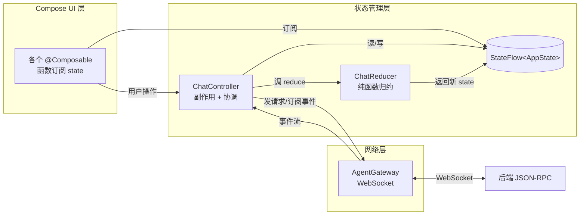
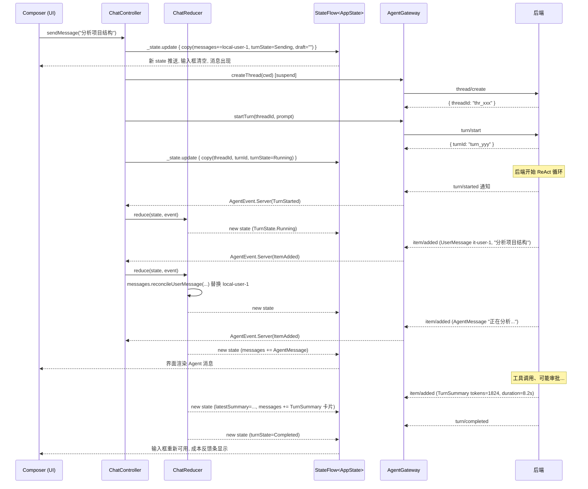

# 12 桌面端状态管理：Reducer + Controller 模式

> 上一章：（待写：11 桌面端 UI 结构） · 下一章：（待写：04-walkthroughs/02 审批流程）
> 预计阅读：40 分钟 · 动手时间：15 分钟
> 适合人群：**Kotlin 不熟也能读**——我们会从 Kotlin 语法讲起。

---

## 🎯 学完你会知道

- BaBiQ 桌面端是怎么"一处状态、处处订阅"的
- **Kotlin 的 `data class` / `sealed interface` / `object` / `when` / `copy()` / `StateFlow` 是什么意思**（看代码必经路）
- 为什么把状态变更拆成 **Reducer**（纯函数）+ **Controller**（副作用）两层，对学习者和测试都有什么好处
- 一次"用户按回车 → 看到 Agent 回复 → 看到本轮 TurnSummary"的完整链路
- 断线时桌面端为什么能保留输入草稿、保留聊天记录、自动重连

---

## 🗺️ 源码地图

这一章涉及 4 个 Kotlin 文件，全部在 `desktop/src/main/kotlin/com/wzx/babiq/desktop/state/`：

| 文件 | 关键符号 | 一句话职责 |
|---|---|---|
| [`AppState.kt`](../../desktop/src/main/kotlin/com/wzx/babiq/desktop/state/AppState.kt) | `data class AppState` | 顶层 UI 状态快照，一切渲染都基于它 |
| [`UiModels.kt`](../../desktop/src/main/kotlin/com/wzx/babiq/desktop/state/UiModels.kt) | `sealed interface ChatMessage`、`AgentEvent`、`enum class ConnectionState/TurnState` 等 | UI 层使用的模型集合 |
| [`ChatReducer.kt`](../../desktop/src/main/kotlin/com/wzx/babiq/desktop/state/ChatReducer.kt) | `object ChatReducer.reduce(state, event)` | 纯函数：旧状态 + 事件 → 新状态 |
| [`ChatController.kt`](../../desktop/src/main/kotlin/com/wzx/babiq/desktop/state/ChatController.kt) | `class ChatController` | 协调副作用（网络/协程）和状态，暴露 `StateFlow<AppState>` 给 UI |

对应测试在 [`desktop/src/test/.../state/`](../../desktop/src/test/kotlin/com/wzx/babiq/desktop/state/) 下：`ChatReducerTest.kt`、`ChatControllerTest.kt`。

---

## 🆕 Kotlin 关键概念速通（看代码前必读）

如果你之前没系统学过 Kotlin，下面几个概念**必须先理解**，否则后面的代码会看得云里雾里。

### 1. `data class` ——"数据载体"类

```kotlin
data class User(val name: String, val age: Int)
```

Kotlin 编译器看到 `data class`，自动帮你生成：

- `equals(other)` 和 `hashCode()`：两个对象字段都相同就被视为相等
- `toString()`：打印出来是 `User(name=张三, age=18)` 而不是 Java 默认的 `User@1a2b3c`
- **`copy(...)` 方法**：基于原对象生成一个新对象，可以只覆盖部分字段
- 解构：`val (n, a) = user`

最关键的是 `copy()`。看一个真实例子：

```kotlin
val state1 = AppState.empty()              // 初始状态
val state2 = state1.copy(turnState = TurnState.Running)  // 只改 turnState，别的字段全部从 state1 拷贝
// state1 没被改动！state2 是全新对象
```

**Kotlin 的不可变 + copy 模式** 就是 BaBiQ 桌面端状态管理的根基。整个 AppState 永远不会被原地修改，每次变化都 copy 一个全新的对象。这样可以：

- 容易测试（旧 state 不会被偷偷改坏）
- Compose UI 框架能正确检测到"状态变了"触发重组
- 出 bug 时容易追踪是哪个事件改了哪个字段

### 2. `sealed interface` ——"枚举升级版"

```kotlin
sealed interface ChatMessage {
    data class User(val id: String, val text: String) : ChatMessage
    data class Agent(val id: String, val text: String) : ChatMessage
    data class Tool(...) : ChatMessage
    // ... 5 个子类，全部在同一文件
}
```

`sealed` 关键字告诉编译器：**这个接口的所有实现类我都列在同一文件里了，没有别的可能性**。

这有什么好处？配合 `when` 表达式可以**穷尽匹配**：

```kotlin
fun render(msg: ChatMessage): String = when (msg) {
    is ChatMessage.User -> "👤 ${msg.text}"
    is ChatMessage.Agent -> "🤖 ${msg.text}"
    is ChatMessage.Tool -> "🔧 ${msg.title}"
    is ChatMessage.FileChange -> "📄 ${msg.path}"
    is ChatMessage.TurnSummary -> "📊 本轮摘要"
    // 如果我漏了一个分支，编译器会报错！
}
```

Java 的 `switch` 没法做到这件事——你漏一个 case 它不会报错，运行时才崩。Kotlin 的 sealed + when 把这种 bug 在编译期就堵掉。

> 在 BaBiQ 里，`ChatMessage`、`AgentEvent`、`ThreadItem` 都是 sealed interface。这就是为什么 reducer 里的 `when` 能放心写——少一个分支立刻编译失败。

### 3. `object` ——"单例对象"

```kotlin
object ChatReducer {
    fun reduce(state: AppState, event: AgentEvent): AppState = ...
}
```

Kotlin 的 `object` 关键字声明一个**全局单例**。`ChatReducer` 全局只有一份实例，可以直接调用 `ChatReducer.reduce(...)`，类似 Java 的 `static` 方法集合。

BaBiQ 用 `object` 表示 Reducer，因为 Reducer 是无状态的纯函数集合，没必要 `new` 出多份。

### 4. `companion object` ——"伴生对象"

```kotlin
data class AppState(...) {
    companion object {
        fun empty(): AppState = AppState()
    }
}

// 调用：
val s = AppState.empty()
```

`companion object` 就是"挂在类上的静态方法"。Kotlin 没有 `static` 关键字，用 `companion object` 代替。

### 5. 扩展函数 + `private fun X.foo()`

```kotlin
private fun List<ChatMessage>.upsert(message: ChatMessage): List<ChatMessage> { ... }

// 调用：
messages.upsert(newMessage)   // 看起来像 List 自己的方法
```

这叫**扩展函数**：给已有类（这里是 `List<ChatMessage>`）"加"一个方法，但不修改原类。`this` 在函数体里指代被扩展的对象。

ChatReducer 里大量用扩展函数，写出来的代码读起来像"消息列表自己会合并消息"，非常顺。

### 6. `when` 表达式

Kotlin 的 `when` 比 Java 的 `switch` 强得多：

```kotlin
when (event) {
    is AgentEvent.ConnectionChanged -> ...   // 类型匹配
    is AgentEvent.Server -> ...
    AgentEvent.Foo -> ...                     // 值匹配
    in setOf(a, b, c) -> ...                  // 集合匹配
    else -> ...
}
```

`when` 还是**表达式**——可以返回值赋给变量：

```kotlin
val banner = when (connectionState) {
    ConnectionState.Connected -> null
    ConnectionState.Connecting -> "正在连接后端..."
    ConnectionState.Reconnecting -> "连接已断开，正在重连..."
    ConnectionState.Disconnected -> "连接已断开，发送和审批已暂停"
}
```

这是 BaBiQ reducer 大量使用的写法，**比 Java 的 if-else 链或者赋值变量再 switch 简洁得多**。

### 7. nullable 类型 `?` 和 elvis 操作符 `?:`

Kotlin 把"可能为空"放进类型系统：

```kotlin
val x: String = "hello"   // 不可空，必须有值
val y: String? = null     // 可空，可以是 null

y.length        // ❌ 编译错误，因为 y 可能是 null
y?.length       // ✅ 安全调用，如果 y == null，整个表达式返回 null
y?.length ?: 0  // ✅ elvis：如果左边是 null 就取右边
```

BaBiQ 里经常看到 `?.let { ... }`：

```kotlin
summary.completedAt?.let { append(" -> ").append(it.shortIsoTime()) }
```

意思是：**如果 `summary.completedAt` 不是 null，就把它作为 `it` 传进 `{ ... }` 里执行**。等价于 Java 的 `if (x != null) { ... }`。

### 8. `StateFlow` ——"永远有当前值的事件流"

这个是 Kotlin Coroutines 库里的概念，理解了它才能看懂 ChatController。

**普通 `Flow` 是冷流**（cold stream）——只有被订阅时才开始生产数据，每个订阅者都从头收一遍。

**`StateFlow` 是热流**（hot stream）：

- 永远持有一个**当前值**
- 新订阅者立即拿到当前值，然后接着收后续更新
- 多个订阅者共享同一份数据流

> 📚 官方说明（kotlinx.coroutines 文档）：
> > StateFlow is a new primitive designed for state handling, intended to eventually replace ConflatedBroadcastChannel for state publication scenarios.

`MutableStateFlow` 是可写版本：

```kotlin
private val _state = MutableStateFlow(AppState.empty())  // 内部可写
val state: StateFlow<AppState> = _state                  // 外部只读

// 更新值：
_state.update { current -> current.copy(turnState = TurnState.Running) }
```

为什么用 `update { }` 而不是 `_state.value = newValue`？因为 `update` 是**原子操作**，多个协程同时改时不会丢更新。

BaBiQ 桌面端的核心：**Compose UI 订阅 `state: StateFlow<AppState>`，状态一变就自动重组对应的界面元素**。

### 9. `suspend` 函数和协程

```kotlin
suspend fun connect() { ... }
```

`suspend` 标记一个函数**可以暂停又恢复**——典型场景是网络请求：发出请求后不阻塞线程，等响应回来再接着跑。

`suspend` 函数**只能在协程或别的 suspend 函数里调用**。Coroutine 是 Kotlin 的"轻量线程"，一个进程可以开几万个协程而不卡。

不深入展开了，只要记住：看到 `suspend` = "这个函数可能要等一会儿，调用方得在协程里"。

---

OK，Kotlin 基础工具齐了。接下来正题。

---

## 📐 整体架构图



**核心原则**：
1. UI 只**读** state，写状态必须经过 Controller
2. Controller 处理所有**副作用**（网络、协程、时间等等）
3. Reducer 是**纯函数**——给同样的 state 和 event，永远返回同样的 newState
4. 状态变化通过 `StateFlow` 推给 UI 自动重组

这种分层和 Redux / Elm Architecture 非常像。学过其中任何一个都能秒懂。

---

## 📖 逐段讲解

### 1. `AppState` —— 所有界面状态的快照

> 📍 看代码：[`AppState.kt`](../../desktop/src/main/kotlin/com/wzx/babiq/desktop/state/AppState.kt) 全文 88 行

整个桌面端的可见状态都浓缩在这一个 data class 里：

```kotlin
// AppState.kt#L33-L55
data class AppState(
    val screen: Screen = Screen.Chat,
    val connectionState: ConnectionState = ConnectionState.Disconnected,
    val turnState: TurnState = TurnState.Idle,
    val workspace: WorkspaceContext = WorkspaceContext(),
    val workspaceProjects: WorkspaceProjectState = WorkspaceProjectState(),
    val providerState: ProviderState = ProviderState(),
    val settingsState: SettingsState = SettingsState(),
    val mcpState: McpState = McpState(),
    val threadHistory: ThreadHistoryState = ThreadHistoryState(),
    val runRecordState: RunRecordState = RunRecordState(),
    val currentThreadId: String? = null,
    val currentThreadTitle: String? = null,
    val currentTurnId: String? = null,
    val messages: List<ChatMessage> = emptyList(),
    val runtimeEvents: List<RuntimeEvent> = emptyList(),
    val latestSummary: ThreadItem.TurnSummary? = null,
    val pendingApproval: PendingApproval? = null,
    val bannerMessage: String? = null,
    val lastError: String? = null,
    val draft: String = "",
    val runtimeExpanded: Boolean = false,
)
```

每个字段都给了默认值，**所以 `AppState()` 就是个合法的"空状态"**。看代码末尾这段：

```kotlin
// AppState.kt#L85-L87
companion object {
    fun empty(): AppState = AppState()
}
```

`AppState.empty()` 是个语义化的工厂函数，可读性比直接写 `AppState()` 高一些。

#### 1.1 派生属性（computed property）—— 把规则集中在状态里

注意 AppState 里有几个 `val xxx: Boolean get() = ...` 形式的字段：

```kotlin
// AppState.kt#L60-L62
val canSend: Boolean
    get() = connectionState == ConnectionState.Connected &&
        turnState !in setOf(TurnState.Sending, TurnState.Running, TurnState.WaitingApproval)
```

这叫**派生属性**——它不存储数据，而是每次访问时按规则计算。

这样写有一个**特别重要的好处**：发送按钮是否可用的规则**只存在于一个地方**。如果你把这个判断散到各个 Composable 里，今天 UI A 写"已连接才能发"，明天 UI B 忘了加"running 时不能发"，UI 行为就开始不一致。

把规则集中在 AppState，所有 Composable 只问 `state.canSend` 就行：

```kotlin
Button(enabled = state.canSend, onClick = { ... })
```

> **设计原则**：业务规则尽量上提到状态模型，UI 只负责渲染。这是声明式 UI 的精髓。

---

### 2. `UiModels` —— 用 sealed interface 表达"几种可能"

> 📍 看代码：[`UiModels.kt`](../../desktop/src/main/kotlin/com/wzx/babiq/desktop/state/UiModels.kt) 全文 485 行

这个文件定义了 AppState 用到的所有子类型，是理解状态管理的基础。

#### 2.1 三个 enum：连接 / Turn / 当前页面

```kotlin
// UiModels.kt#L18-L41
enum class ConnectionState { Disconnected, Connecting, Connected, Reconnecting }
enum class TurnState { Idle, Sending, Running, WaitingApproval, Completed, Failed, Canceled }
enum class Screen { Chat, Settings, Mcp }
```

`enum class` 是 Kotlin 的枚举（和 Java 类似）。用 enum 而不是字符串常量的好处：编译器知道有哪些可能值，配合 `when` 能做穷尽匹配。

#### 2.2 `ChatMessage`——聊天列表的"消息变种"

这是 sealed interface 最经典的应用：聊天列表里能出现**用户消息**、**Agent 消息**、**工具卡片**、**文件变更卡**、**TurnSummary 摘要卡**五种东西。它们字段不同、渲染方式不同，但都是"消息列表的一行"。

```kotlin
// UiModels.kt#L49-L119
sealed interface ChatMessage {
    val id: String   // 所有子类都有 id

    data class User(override val id: String, val text: String) : ChatMessage
    data class Agent(override val id: String, val text: String, val streaming: Boolean = false) : ChatMessage
    data class Tool(override val id: String, val title: String, val status: String, val detail: String) : ChatMessage
    data class FileChange(override val id: String, val action: String, val path: String, val status: String, val preview: String?) : ChatMessage
    data class TurnSummary(override val id: String, val summary: ThreadItem.TurnSummary) : ChatMessage
}
```

注意：
- 每个子类都是 `data class`，所以自动有 `copy()`、`equals()`、`toString()`
- `override val id` 强制每个子类都要有 `id` 字段
- `summary: ThreadItem.TurnSummary` 表示直接复用后端协议字段

**为什么 `id` 必须有？** 看 UiModels.kt#L51 的注释：

```kotlin
/** Compose LazyColumn 用 id 来稳定列表项，避免更新时整列表闪动。 */
val id: String
```

Compose 的 `LazyColumn`（懒加载列表）需要稳定的 `key` 来判断"这一项是不是同一个 item"，从而决定是复用还是重建。如果消息没有 id，更新一条消息时整个列表会重新渲染，体验很差。

#### 2.3 `AgentEvent`——reducer 唯一的输入

```kotlin
// UiModels.kt#L480-L484
sealed interface AgentEvent {
    data class Server(val event: ServerEvent) : AgentEvent
    data class ConnectionChanged(val state: ConnectionState) : AgentEvent
    data class RequestFailed(val message: String) : AgentEvent
}
```

reducer 只接受这三种事件之一：
- `Server`：后端推过来的 JSON-RPC 通知（如 `turn/started`、`item/added`）
- `ConnectionChanged`：传输层连接状态变化（由 ChatController 主动发）
- `RequestFailed`：Controller 自己的请求失败了（如发送时网络抖动）

**这种"统一事件入口"的设计**让 reducer 永远只在一处分派，调试和测试都容易。

#### 2.4 其他 data class：状态的子树

剩下大量的 data class 都是 AppState 各个字段对应的"子状态"：

- `WorkspaceContext`、`WorkspaceProjectItem`、`WorkspaceProjectState`——工作目录
- `ProviderSelection`、`ProviderState`——Provider/模型
- `SettingsState`、`ProviderEditorState`——设置页
- `McpState`——MCP 页面
- `ThreadListItem`、`ThreadHistoryState`——最近会话
- `RunTurnListItem`、`RunRecordState`、`ObservabilityState`——运行详情
- `RuntimeEvent`、`PendingApproval`——临时事件

每个都不可变 data class，每个变化都用 copy 生成新对象。看一个例子：

```kotlin
// UiModels.kt#L200-L216
companion object {
    fun from(summary: RunTurnSummaryInfo): RunTurnListItem =
        RunTurnListItem(
            turnId = summary.turnId,
            statusLabel = summary.status.statusLabel(),     // 调用扩展函数
            inputPreview = summary.inputText.ifBlank { "空输入" }.take(80),
            modelLabel = summary.model ?: summary.providerId ?: "未记录模型",   // 双 elvis
            timeLabel = buildString {
                append(summary.startedAt.shortIsoTime())
                summary.completedAt?.let { append(" -> ").append(it.shortIsoTime()) }
            },
            recoveryReason = summary.recoveryReason,
        )
}
```

里面这两行特别能体现 Kotlin 风格：

```kotlin
modelLabel = summary.model ?: summary.providerId ?: "未记录模型"
```
等价于 Java 的：
```java
String modelLabel = summary.model != null ? summary.model
                  : summary.providerId != null ? summary.providerId
                  : "未记录模型";
```

```kotlin
summary.completedAt?.let { append(" -> ").append(it.shortIsoTime()) }
```
等价于：
```java
if (summary.completedAt != null) {
    sb.append(" -> ").append(shortIsoTime(summary.completedAt));
}
```

**Kotlin 用 8 个字符干完了 Java 50 个字符的活，可读性还高。** 这就是为什么桌面端选 Kotlin。

---

### 3. `ChatReducer` —— 纯函数归约

> 📍 看代码：[`ChatReducer.kt`](../../desktop/src/main/kotlin/com/wzx/babiq/desktop/state/ChatReducer.kt) 全文 192 行

#### 3.1 入口：单一分派函数

```kotlin
// ChatReducer.kt#L30-L40
fun reduce(state: AppState, event: AgentEvent): AppState =
    when (event) {
        is AgentEvent.ConnectionChanged -> reduceConnection(state, event.state)
        is AgentEvent.RequestFailed -> state.copy(
            lastError = event.message,
            bannerMessage = event.message,
            turnState = TurnState.Failed,
        )
        is AgentEvent.Server -> reduceServerEvent(state, event.event)
    }
```

注意几个细节：

1. **整个函数体就是一个 `when` 表达式**——这是 Kotlin 表达式函数的写法 `fun foo() = expression`，不需要 `{ return ... }`
2. `is AgentEvent.RequestFailed` 后面是**智能类型转换**（smart cast）——编译器知道这分支里 `event` 一定是 `RequestFailed`，所以可以直接访问 `event.message`，不用强转
3. `state.copy(...)` 生成新 state，老 state 完全不动

**这就是纯函数**：输入相同则输出相同，没有副作用。能用单元测试很容易验证：

```kotlin
// ChatReducerTest.kt#L101-L109
@Test
fun `connection change updates disabled state inputs`() {
    val state = AppState.empty()
    val next = ChatReducer.reduce(state, AgentEvent.ConnectionChanged(ConnectionState.Disconnected))
    assertEquals(ConnectionState.Disconnected, next.connectionState)
    assertNotNull(next.bannerMessage)
}
```

> 顺便：Kotlin 的测试方法名可以用反引号包字符串：`` `connection change updates disabled state inputs` ``。这让测试报告读起来像自然语言。

#### 3.2 连接状态翻译成 banner 文案

```kotlin
// ChatReducer.kt#L45-L53
private fun reduceConnection(state: AppState, connectionState: ConnectionState): AppState {
    val banner = when (connectionState) {
        ConnectionState.Connected -> null
        ConnectionState.Connecting -> "正在连接后端..."
        ConnectionState.Reconnecting -> "连接已断开，正在重连..."
        ConnectionState.Disconnected -> "连接已断开，发送和审批已暂停"
    }
    return state.copy(connectionState = connectionState, bannerMessage = banner)
}
```

`when` 表达式直接把枚举值映射成文案。这种写法的好处：

- 添加新的 `ConnectionState` 枚举值时，编译器立刻报错（因为 `when` 必须穷尽）
- 不会出现"漏处理某个状态"的 bug

#### 3.3 服务端事件分派

```kotlin
// ChatReducer.kt#L58-L104
private fun reduceServerEvent(state: AppState, event: ServerEvent): AppState =
    when (event) {
        is ServerEvent.TurnStarted -> state.copy(
            currentThreadId = event.threadId,
            currentTurnId = event.turnId,
            turnState = TurnState.Running,
            lastError = null,
        )

        is ServerEvent.ItemAdded -> state.withItem(event.item)
        is ServerEvent.ItemUpdated -> state.withItem(event.item)
        is ServerEvent.ItemCompleted -> state.withItem(event.item)

        is ServerEvent.ApprovalRequested -> state.copy(
            turnState = TurnState.WaitingApproval,
            pendingApproval = PendingApproval.from(event.request),
        )

        is ServerEvent.TurnCompleted -> state.copy(...)
        is ServerEvent.TurnFailed -> state.copy(...)
        is ServerEvent.Unknown -> state.copy(...)
    }
```

每一种后端事件对应一个 state 变换。整段逻辑像一张"事件→状态变化"的表。

**注意 `Unknown` 这一行**——它存在的意义是**协议向前兼容**：哪天后端加了一种新的事件类型，桌面端不会崩，而是把这条事件塞进运行详情面板供调试。这是个**优秀的设计模式**，可以参考。

#### 3.4 扩展函数 `withItem`——把 item 合并到 state

```kotlin
// ChatReducer.kt#L109-L135
private fun AppState.withItem(item: ThreadItem): AppState =
    when (item) {
        is ThreadItem.TurnSummary -> copy(
            latestSummary = item,
            messages = messages.upsert(ChatMessage.TurnSummary(item.id, item)),
            runtimeEvents = runtimeEvents + RuntimeEvent(
                id = item.id,
                title = "TurnSummary",
                detail = "模型 ${item.model}，tokens ${item.totalTokens}，工具 ${item.toolCalls} 次",
            ),
        )
        is ThreadItem.Unknown -> copy(...)
        is ThreadItem.UserMessage -> copy(
            messages = messages.reconcileUserMessage(ChatMessage.User(item.id, item.text)),
        )
        else -> copy(messages = messages.upsert(item.toChatMessage()))
    }
```

注意写法 `private fun AppState.withItem(...)`——这是**给 AppState 类加的扩展函数**。函数体里直接写 `copy(...)`、`messages.upsert(...)`，因为 `this` 就是当前的 AppState。

调用方写起来就像：

```kotlin
state.withItem(item)   // 顺起来读：state with item
```

非常自然。

#### 3.5 列表 upsert——避免列表抖动

```kotlin
// ChatReducer.kt#L166-L172
private fun List<ChatMessage>.upsert(message: ChatMessage): List<ChatMessage> {
    val existingIndex = indexOfFirst { it.id == message.id }
    if (existingIndex < 0) {
        return this + message
    }
    return toMutableList().also { messages -> messages[existingIndex] = message }
}
```

`upsert` = update or insert：

- 如果已有相同 id 的消息：**原位置替换**（这样 Compose LazyColumn 不会把这一项当成"新加的"重建动画）
- 如果没有：**追加到末尾**

`item/updated` 事件可能对同一个 id 多次推送（如 Agent 流式输出），upsert 保证 UI 看到的是稳定的"这条消息在更新"，而不是"一条接一条新消息"。

#### 3.6 乐观更新协调

```kotlin
// ChatReducer.kt#L178-L191
private fun List<ChatMessage>.reconcileUserMessage(message: ChatMessage.User): List<ChatMessage> {
    val existingIndex = indexOfFirst { it.id == message.id }
    if (existingIndex >= 0) {
        return toMutableList().also { messages -> messages[existingIndex] = message }
    }

    val optimisticIndex = indexOfLast {
        it is ChatMessage.User && it.id.startsWith("local-user-") && it.text == message.text
    }
    if (optimisticIndex < 0) {
        return this + message
    }
    return toMutableList().also { messages -> messages[optimisticIndex] = message }
}
```

这段是**乐观更新**模式：

- 用户按下回车时，Controller 立刻把消息加到列表（id 为 `local-user-1` 等占位）
- 后端确认收到后会回推一条**正式的** `userMessage`（id 是 `it-user-...`）
- reducer 收到正式版时，发现存在文本一样的占位消息，**就地替换**——避免界面同一条消息出现两次

这是聊天 UI 的经典需求，BaBiQ 写得很干净。

---

### 4. `ChatController` —— 协调副作用与状态

> 📍 看代码：[`ChatController.kt`](../../desktop/src/main/kotlin/com/wzx/babiq/desktop/state/ChatController.kt) 全文 298 行

Reducer 是纯函数，但纯函数自己不会发出网络请求、不会启动协程、不会知道时间。这些**副作用**都在 ChatController。

#### 4.1 类签名和字段

```kotlin
// ChatController.kt#L37-L47
class ChatController(
    private val gateway: AgentGateway,
    private val scope: CoroutineScope = CoroutineScope(SupervisorJob() + Dispatchers.Default),
    initialState: AppState = AppState.empty(),
    private val reconnectPolicy: ReconnectPolicy = ReconnectPolicy(),
) {
    private val _state = MutableStateFlow(initialState)
    private var collectingEvents = false
    private var reconnectJob: Job? = null

    val state: StateFlow<AppState> = _state
```

几个学习点：

1. **构造函数参数即字段**：Kotlin 类的主构造函数参数直接是字段（如果用 `val`/`var` 修饰）。比 Java 写一堆 `this.gateway = gateway` 干净。

2. **依赖注入**：`gateway` 和 `scope` 都通过构造函数注入，所以测试时能传一个 fake gateway 进来——这就是为什么 `ChatControllerTest` 能不连真后端就跑。

3. **`SupervisorJob()`**：让其中一个子协程崩了，不影响其他协程。`Dispatchers.Default` 是后台线程池，**不是** UI 线程。

4. **私有 `_state`，公开只读 `state`**：经典模式。外部只能读，内部用 `_state.update { ... }` 修改。

#### 4.2 `connect()`——主动连接 + 自动重连

```kotlin
// ChatController.kt#L49-L59
suspend fun connect() {
    // 用户点击"重试"时应立即尝试一次，所以先取消后台自动重连任务。
    reconnectJob?.cancel()
    reconnectJob = null
    applyEvent(AgentEvent.ConnectionChanged(ConnectionState.Connecting))
    try {
        connectOnce()
    } catch (exception: Exception) {
        handleConnectionFailure(exception)
    }
}
```

注意：

- `suspend` 修饰，表示这是个协程函数
- `reconnectJob?.cancel()`：如果有正在运行的重连任务（典型场景：用户上次断线后桌面端在自动重连），先取消它再立即尝试
- `applyEvent(...)`：通过 reducer 把"正在连接"的状态写进 StateFlow，UI 立刻看到 banner

#### 4.3 `applyEvent()`——状态变更的唯一入口

```kotlin
// ChatController.kt#L196-L198
fun applyEvent(event: AgentEvent) {
    _state.update { ChatReducer.reduce(it, event) }
}
```

**整个 controller 唯一能改 state 的入口**就是这一行。所有状态变化最终都经过 reducer。

`_state.update { it -> ... }`：

- `it` 是当前 state
- lambda 返回新 state
- 整个操作原子完成（避免多个协程同时改 state 时丢更新）

这就是为什么 Kotlin StateFlow 比手动 `synchronized` 干净——把"读-改-写"封装成 update 一个动作。

#### 4.4 `sendMessage()`——一次完整的用户操作

```kotlin
// ChatController.kt#L61-L124
suspend fun sendMessage(text: String) {
    val prompt = text.trim()
    if (prompt.isBlank()) {
        return
    }
    val current = state.value
    if (current.connectionState != ConnectionState.Connected) {
        _state.update {
            it.copy(
                draft = text,
                lastError = "后端未连接，无法发送任务",
                bannerMessage = "后端未连接，无法发送任务",
            )
        }
        return
    }
    if (!current.canSend) {
        _state.update {
            it.copy(
                draft = text,
                lastError = "当前 turn 仍在运行，暂不能发送新任务",
                bannerMessage = "当前 turn 仍在运行，暂不能发送新任务",
            )
        }
        return
    }

    // 乐观更新：立刻把用户消息加到列表
    val localMessage = ChatMessage.User(id = "local-user-${current.messages.size + 1}", text = prompt)
    _state.update {
        it.copy(
            turnState = TurnState.Sending,
            draft = "",
            lastError = null,
            bannerMessage = null,
            messages = it.messages + localMessage,
        )
    }

    try {
        val threadId = current.currentThreadId ?: gateway.createThread(current.workspace.cwd)
        val turnId = gateway.startTurn(
            threadId = threadId,
            prompt = prompt,
            providerId = current.providerState.active.providerId.takeIf { selectedProvider ->
                current.providerState.providers.any { it.id == selectedProvider }
            },
        )
        _state.update {
            it.copy(
                currentThreadId = threadId,
                currentTurnId = turnId,
                turnState = TurnState.Running,
            )
        }
    } catch (exception: Exception) {
        _state.update {
            it.copy(
                turnState = TurnState.Failed,
                lastError = exception.message ?: "发送失败",
                bannerMessage = exception.message ?: "发送失败",
            )
        }
    }
}
```

这一个方法浓缩了 BaBiQ 桌面端的所有关键模式：

1. **前置校验**：连接状态、能否发送（用 AppState 的派生属性 `canSend`）
2. **乐观更新**：先把用户消息加到列表，UI 立即响应
3. **发请求**：`gateway.createThread(...)` 和 `gateway.startTurn(...)`，都是 suspend 函数
4. **成功更新**：写入 thread/turn id，进入 Running 状态
5. **失败兜底**：异常被 catch 后变成可见的 `lastError`，不让协程崩溃

注意这一行：

```kotlin
val threadId = current.currentThreadId ?: gateway.createThread(current.workspace.cwd)
```

elvis 操作符 `?:` 在这里特别优雅：**如果已经有 threadId 就复用，否则创建新 thread**。一行代码搞定。

#### 4.5 `scheduleReconnect()`——指数退避重连

```kotlin
// ChatController.kt#L220-L252
private fun scheduleReconnect() {
    if (reconnectJob?.isActive == true) {
        return
    }
    reconnectJob = scope.launch {
        var delayMs = reconnectPolicy.initialDelayMs
        while (true) {
            _state.update {
                it.copy(
                    connectionState = ConnectionState.Reconnecting,
                    bannerMessage = "连接已断开，${delayMs / 1_000} 秒后自动重试",
                )
            }
            delay(delayMs)
            try {
                connectOnce()
                reconnectJob = null
                return@launch
            } catch (exception: Exception) {
                _state.update { it.copy(...) }
                delayMs = reconnectPolicy.nextDelayAfter(delayMs)
            }
        }
    }
}
```

这是一段非常典型的 Kotlin 协程代码。学习点：

1. **`scope.launch { ... }`**：在协程作用域里启动一个新协程，返回一个 `Job`
2. **`while (true)` + `delay(delayMs)`**：循环重试，每次等待 `delayMs` 毫秒。`delay` 是 suspend 函数，**不阻塞线程**——它只是把这个协程挂起，等时间到再恢复
3. **`reconnectPolicy.nextDelayAfter(delayMs)`**：指数退避（1s → 2s → 4s → 8s → 10s 上限）
4. **`return@launch`**：从这个 launch 协程返回（普通 `return` 会从外层函数返回，加 `@launch` 限定）

对应的 `ReconnectPolicy`：

```kotlin
// ChatController.kt#L22-L28
data class ReconnectPolicy(
    val initialDelayMs: Long = 1_000,
    val maxDelayMs: Long = 10_000,
) {
    fun nextDelayAfter(previousDelayMs: Long): Long =
        (previousDelayMs * 2).coerceAtMost(maxDelayMs)
}
```

`coerceAtMost(10_000)` 把上界限制在 10 秒。这是 Kotlin 标准库的扩展函数，比 `Math.min(x, 10_000)` 可读性更高。

---

## 🔄 完整事件流：一次"分析项目"任务

现在把所有部分串起来。用户输入"分析 E:\BaBiQ 项目结构"按回车，会发生：



**关键观察**：

- UI 只发起意图（按回车 → `sendMessage`），不直接改状态
- Controller 协调网络调用，把网络回来的事件转给 reducer
- Reducer 把事件折叠进 state
- StateFlow 推送新 state，UI 自动重组
- **整条链路只在一个地方改状态：`_state.update`**

这就是为什么这套架构容易测试、容易调试、容易扩展。

---

## 🔧 动手实操

### 实操 1：跑 reducer 测试看实际行为

```powershell
cd E:\BaBiQ\desktop
.\gradlew.bat test --tests "*ChatReducerTest"
```

如果第一次跑可能 build cache 是 UP-TO-DATE，加 `--rerun-tasks` 强制重跑：

```powershell
.\gradlew.bat test --tests "*ChatReducerTest" --rerun-tasks
```

预期输出：所有 6 个测试通过。

### 实操 2：读测试用例理解行为

打开 [`ChatReducerTest.kt`](../../desktop/src/test/kotlin/com/wzx/babiq/desktop/state/ChatReducerTest.kt)，重点看这一个：

```kotlin
@Test
fun `server userMessage replaces matching optimistic user message`() {
    val state = AppState.empty().copy(
        messages = listOf(ChatMessage.User("local-user-1", "你好啊")),
        turnState = TurnState.Running,
    )
    val serverUserMessage = ThreadItem.UserMessage(id = "it-user-1", text = "你好啊")

    val next = ChatReducer.reduce(
        state,
        AgentEvent.Server(ServerEvent.ItemAdded("thread-1", "turn-1", serverUserMessage)),
    )

    assertEquals(1, next.messages.size)
    val userMessage = assertIs<ChatMessage.User>(next.messages.single())
    assertEquals("it-user-1", userMessage.id)
    assertEquals("你好啊", userMessage.text)
}
```

这个测试就是验证 §3.6 讲的"乐观更新协调"——本地 `local-user-1` 被后端正式 `it-user-1` 替换，消息**不重复**。

### 实操 3：自己加一个新事件，跑通编译

打开 `UiModels.kt`，给 `AgentEvent` 加一个新子类：

```kotlin
sealed interface AgentEvent {
    data class Server(...) : AgentEvent
    data class ConnectionChanged(...) : AgentEvent
    data class RequestFailed(...) : AgentEvent
    data class UserCancelled(val turnId: String) : AgentEvent   // ← 新增
}
```

然后编译：

```powershell
.\gradlew.bat compileKotlin
```

**编译会失败！** 因为 `ChatReducer.reduce` 的 `when` 表达式现在不再穷尽。错误信息类似：

```
ChatReducer.kt:32: 'when' expression must be exhaustive, add necessary 'is UserCancelled' branch or 'else' branch instead
```

这就是 sealed 的威力：**新增分支立刻被强制处理，没有"漏掉一个 case"的可能**。

加上分支编译就过了：

```kotlin
fun reduce(state: AppState, event: AgentEvent): AppState = when (event) {
    is AgentEvent.ConnectionChanged -> reduceConnection(state, event.state)
    is AgentEvent.RequestFailed -> state.copy(...)
    is AgentEvent.Server -> reduceServerEvent(state, event.event)
    is AgentEvent.UserCancelled -> state.copy(turnState = TurnState.Canceled)  // ← 新增
}
```

记得做完实验**把代码还原**，因为这只是练习。

---

## 🧠 思考题

回答下面的问题能检验你是否理解了这一章。

1. **`AppState` 是 `data class` 而不是 `class`，去掉 `data` 会有什么影响？**
   提示：想想 `copy()` 还能不能用，`_state.update { it.copy(...) }` 还会工作吗？

2. **为什么 `ChatReducer` 用 `object` 而不是 `class`？**
   提示：reducer 有状态吗？

3. **`val canSend: Boolean get() = ...` 和 `val canSend: Boolean = ...` 写法上一字之差，运行行为差别在哪？**
   提示：什么时候求值？

4. **`_state.update { it -> it.copy(...) }` 比 `_state.value = _state.value.copy(...)` 好在哪？**
   提示：多协程并发会发生什么？

5. **Reducer 是纯函数为什么这么重要？如果让 Reducer 直接调用网络，会出什么问题？**
   提示：测试、调试、可重放性。

6. **`scheduleReconnect()` 里如果把 `delay(delayMs)` 换成 `Thread.sleep(delayMs)`，会发生什么？**
   提示：协程和线程的区别。

7. **`sealed interface ChatMessage` 比 `interface ChatMessage` 多带来了什么？**
   提示：编译期穷尽检查、子类位置限制。

8. **`val threadId = current.currentThreadId ?: gateway.createThread(current.workspace.cwd)` 这行如果 `currentThreadId` 是 `null`，会调用 `createThread` 吗？如果不是 `null` 呢？**
   提示：elvis 的短路求值。

---

## ❓ 常见疑惑

### Q1：Compose UI 是怎么"自动重组"的？StateFlow 怎么和 UI 串起来？

桌面端在 Composable 里这样订阅 state：

```kotlin
@Composable
fun ChatScreen(controller: ChatController) {
    val state by controller.state.collectAsState()  // 订阅 StateFlow
    Text("当前 turn: ${state.turnState}")
    Button(enabled = state.canSend, onClick = { ... }) { Text("发送") }
}
```

`collectAsState()` 是 Compose 提供的扩展，它把 `StateFlow<T>` 转成 Compose 的 `State<T>`。`State<T>` 的特点是：**Compose 运行时知道哪些 Composable 读了它**，state 一变就只重组**读过它的那些** Composable，不会整个界面刷新。

> 这一章先不深入 Compose；详细的 Composable 写法和性能优化看后续的 11 章。

### Q2：为什么不直接用全局变量当状态？

全局变量有几个问题：

1. 谁改了它你不知道（reducer 单点 + state log 就能完美追踪）
2. 改变时 UI 不会自动响应（需要手动通知监听者）
3. 测试时会污染下一次测试

`StateFlow` 解决了 1 和 2；`MutableStateFlow` 配合 `update { copy }` 解决了 3。

### Q3：为什么要分 Reducer 和 Controller 两层？合一层不就行了？

合一层也能跑，但有几个明显的好处分开做：

- **Reducer 是纯函数，可以做"重放测试"**：把一连串事件喂给 reducer，验证最终 state——非常适合回归测试。
- **Controller 包含网络/协程/时间，难测试**——但隔离它后，业务逻辑（reducer）仍然好测。
- **未来扩展空间**：哪天想加"撤销重做"功能，只要保存历史 state 列表即可，因为 reducer 是纯函数（同样输入永远同样输出）。

### Q4：BaBiQ 用了 Redux 吗？

没有显式用 Redux 库。**模式上类似 Redux**（state + action + reducer + store），但用 Kotlin StateFlow 自己实现，比加一个第三方库轻量得多。

### Q5：`suspend` 函数我怎么调用？我没在协程里啊

如果你在 Composable 里：

```kotlin
val scope = rememberCoroutineScope()
Button(onClick = {
    scope.launch {
        controller.sendMessage("分析项目")  // 在协程里调 suspend
    }
}) { Text("发送") }
```

`rememberCoroutineScope()` 提供一个绑在 Composable 生命周期上的协程作用域。当 Composable 离开屏幕，协程会被自动取消，避免泄漏。

---

## ➡️ 延伸阅读

- **接下来看后端怎么处理这些请求**：（待写）02-reading-path/02-agent-core.md
- **想看 UI 长什么样、怎么写**：（待写）02-reading-path/11-desktop-ui.md
- **Kotlin 官方协程文档**：<https://kotlinlang.org/docs/coroutines-guide.html>
- **StateFlow 设计文档（kotlinx.coroutines）**：<https://kotlinlang.org/api/kotlinx.coroutines/kotlinx-coroutines-core/kotlinx.coroutines.flow/-state-flow/>
- **Compose Multiplatform Desktop 入门**：<https://www.jetbrains.com/compose-multiplatform/>

---

## ✅ 自检清单

读完这一章，你应该能做到：

- [ ] 不查文档说出 `data class`、`sealed interface`、`object` 的区别
- [ ] 解释清楚 `copy()` 为什么是不可变状态管理的关键
- [ ] 看到 `?:`、`?.let`、`!!` 能立刻反应过来含义
- [ ] 解释 `StateFlow` 和普通 `Flow` 的区别
- [ ] 能描述一次"按回车"事件从 UI 走到 StateFlow 的完整路径
- [ ] 能解释为什么 Reducer 是纯函数、Controller 是副作用层
- [ ] 跑通 `ChatReducerTest` 并改写其中一个用例
