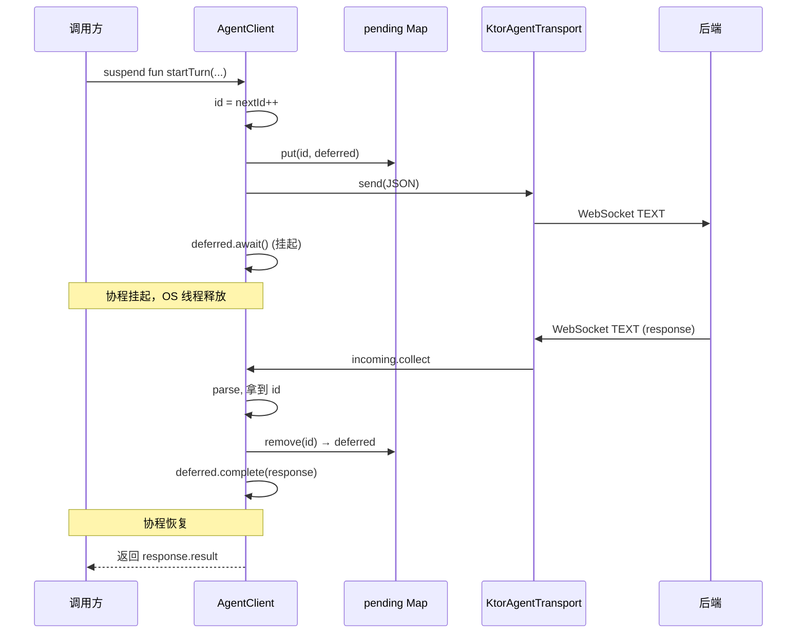

# 深入 04：协议层（JSON-RPC + WebSocket + Kotlin 协程）

> 前几章已经把 BaBiQ 的「Agent 内核」「上下文工程」「安全机制」讲透。
> 这一章讲**连接两端的管道**——后端怎么对外说话、桌面端怎么听、为什么用 JSON-RPC 而不是 REST、为什么是 WebSocket 而不是 SSE、Kotlin 协程怎么把异步消息变成同步代码。

---

## 🎯 学完你会知道

1. JSON-RPC 2.0 协议的**4 种 wire 形态**（Request / Response / Notification / ErrorResponse）以及它们的强类型实现。
2. BaBiQ 的**完整 method 字典**（~50 个 method 按域分类）。
3. 后端 `JsonRpcWebSocketHandler` → `JsonRpcDispatcher` → 具体 `JsonRpcMethodHandler` 的三层 dispatch 链路。
4. 标准 JSON-RPC 错误码（`-32700` ~ `-32603`）+ BaBiQ 业务错误码的映射策略。
5. 桌面端**端口-适配器**模式：`AgentTransport`（端口）→ `KtorAgentTransport`（适配器）→ `AgentClient`（协议语义）。
6. Kotlin 协程怎么把异步 WebSocket 包成「`suspend fun` 同步调用」：`CompletableDeferred + ConcurrentHashMap` 请求-响应配对。
7. `SharedFlow` 广播 notification、`StateFlow` 暴露 UI 状态、断线-重连退避策略。
8. 为什么 BaBiQ 选 WebSocket 而不是 SSE / REST / gRPC，各自取舍。

---

## 🧱 预备知识

- 看过 [04-walkthroughs/01-read-file-full-trace.md](../04-walkthroughs/01-read-file-full-trace.md) §阶段 3-6 + §阶段 21-25（看一次真实 WebSocket 往返）。
- 看过 [02-reading-path/12-desktop-state.md](../02-reading-path/12-desktop-state.md)（理解 StateFlow / Reducer）。
- 知道 JSON 是什么、知道 HTTP/WebSocket 是不同的协议。
- Kotlin 协程 / suspend 基础（不熟也行，§8 会展开）。

---

## 1. 为什么需要专门的协议层

如果你随手写一个本地 Agent demo，最简单方案是：

```
桌面端 → HTTP POST /turn/start → 后端
```

为什么 BaBiQ 不这样？让我们看几个**真实需求**：

| 需求 | 纯 HTTP 行得通吗 |
|---|---|
| 一次 turn 内多次 emit `item/added`（用户消息 / 工具调用 / TurnSummary） | ❌ HTTP response 只能一次性返回 |
| `approval/request` 服务端主动推送 | ❌ HTTP 服务端不能主动推 |
| 桌面端发 `turn/interrupt` 中断正在跑的 turn | ❌ HTTP request-response 是无状态的 |
| 网络断了，UI 立刻显示「Reconnecting」 | ❌ HTTP 是无连接的，断没断不知道 |
| 桌面端 5 秒内连续发 10 个请求 | ⚠️ HTTP 可以但每次都要 TCP 握手 |

**解决方案**：长连接 + 双向消息。候选方案对比：

| 方案 | 双向？ | 服务端推 | 强类型 | 复杂度 | BaBiQ 选 |
|---|---|---|---|---|---|
| **HTTP REST** | ❌ | ❌ | ✅ | 低 | ❌ |
| **HTTP + SSE** | ❌（SSE 只下行） | ✅ | ⚠️ 半 | 中 | ❌ |
| **WebSocket + 自定义文本** | ✅ | ✅ | ⚠️ 看实现 | 中 | ❌ |
| **WebSocket + JSON-RPC 2.0** | ✅ | ✅ | ✅ | 中 | ✅ |
| **gRPC bidi streaming** | ✅ | ✅ | ✅✅ | 高 | ❌ |

**为什么 JSON-RPC 2.0**：
- ✅ 行业标准（2010 发布），生态成熟。
- ✅ 不需要 IDL 工具链（vs gRPC）。
- ✅ 4 种 wire 形态明确（Request / Response / Notification / ErrorResponse）。
- ✅ 标准错误码已经定义（`-32700` ~ `-32600`）。
- ✅ 调试友好：直接读 JSON，浏览器开发者工具就能看。

**为什么 WebSocket**：
- ✅ 一条长连接承载双向消息流。
- ✅ 文本帧天然适合 JSON 文本。
- ✅ 浏览器 / Ktor / OkHttp / Spring 都有成熟实现。
- ✅ 断线检测靠 ping/pong + heartbeat。

**BaBiQ 选择**：JSON-RPC 2.0 over WebSocket，端点 `/ws/agent`。

---

## 2. JSON-RPC 2.0 速成

如果你已经熟悉 JSON-RPC，这一节可以跳过到 §3。

### 2.1 4 种 wire 形态

JSON-RPC 2.0 规范定义了 4 种「在线上传输的报文」：

#### 2.1.1 Request（请求）

客户端发起，必须带 `id`：

```json
{
  "jsonrpc": "2.0",
  "id": 42,
  "method": "turn/start",
  "params": {"threadId": "th-xxx", "input": {"text": "..."}}
}
```

字段：
- `jsonrpc`：固定 `"2.0"`。
- `id`：调用 id，服务端会用同一个 id 回 response。
- `method`：方法名。
- `params`：参数（对象或数组）。

#### 2.1.2 Response（成功响应）

服务端处理完返回，**`id` 与 request 对应**：

```json
{
  "jsonrpc": "2.0",
  "id": 42,
  "result": {"turnId": "tu-xxx", "status": "RUNNING"}
}
```

字段：
- `jsonrpc`：固定 `"2.0"`。
- `id`：对应 request id。
- `result`：业务结果。

#### 2.1.3 ErrorResponse（错误响应）

服务端处理出错时返回：

```json
{
  "jsonrpc": "2.0",
  "id": 42,
  "error": {"code": -32602, "message": "Invalid params: threadId is required"}
}
```

字段：
- `jsonrpc`：固定 `"2.0"`。
- `id`：对应 request id（parse error 可以为 `null`）。
- `error.code`：错误码。
- `error.message`：错误描述。
- `error.data`：可选调试数据。

#### 2.1.4 Notification（通知）

**没有 `id`** 的报文。客户端发出表示「不需要响应」，服务端发出表示「主动推送」：

```json
{
  "jsonrpc": "2.0",
  "method": "item/added",
  "params": {"threadId": "th-xxx", "turnId": "tu-xxx", "item": {...}}
}
```

字段：
- `jsonrpc`：固定 `"2.0"`。
- `method`：方法名。
- `params`：参数。
- **没有** `id`。

⚠️ **`id` 字段是 Request 和 Notification 的关键区别**：有 id 是 Request（要响应），没 id 是 Notification（不要响应）。

### 2.2 标准错误码

| 码 | 名称 | 含义 | 触发 |
|---|---|---|---|
| `-32700` | Parse error | JSON 都解析不了 | 报文不是合法 JSON |
| `-32600` | Invalid Request | JSON 是对的但 envelope 不符合 JSON-RPC | 缺 `method` 字段等 |
| `-32601` | Method not found | method 不存在 | 客户端调了一个后端不认识的 method |
| `-32602` | Invalid params | params 不符合预期 | 缺必填字段 / 类型不对 |
| `-32603` | Internal error | 服务端内部错误 | handler 抛了未预期异常 |
| `-32000` ~ `-32099` | Server error | 实现自定义保留段 | 业务错误 |

**BaBiQ 全部用这 6 类**，再加上 ~32098（传输已断开）等业务级错误。

### 2.3 「批处理」

JSON-RPC 2.0 还支持把多个 Request 打包成 JSON Array 一次发送。

**BaBiQ 不用批处理**，理由：
- 简化协议实现。
- WebSocket 本身就够快，不需要为了减少 round-trip 而批。
- 调试难（多个调用混在一起难以单独追踪）。

---

## 3. BaBiQ 的 4 种 wire 形态实现

📁 **`backend/src/main/java/com/wzx/babiq/server/api/JsonRpcMessage.java`**

```java
@JsonInclude(JsonInclude.Include.NON_NULL)
public sealed interface JsonRpcMessage
        permits JsonRpcMessage.Request,
                JsonRpcMessage.Response,
                JsonRpcMessage.Notification,
                JsonRpcMessage.ErrorResponse {

    String jsonrpc();

    record Request(
            @JsonProperty(required = true) String jsonrpc,
            @JsonProperty(required = true) Long id,
            @JsonProperty(required = true) String method,
            Object params
    ) implements JsonRpcMessage {}

    record Response(
            @JsonProperty(required = true) String jsonrpc,
            @JsonProperty(required = true) Long id,
            @JsonProperty(required = true) Object result
    ) implements JsonRpcMessage {
        public static Response ok(Long id, Object result) {
            return new Response("2.0", id, result);
        }
    }

    record Notification(
            @JsonProperty(required = true) String jsonrpc,
            @JsonProperty(required = true) String method,
            Object params
    ) implements JsonRpcMessage {
        public static Notification of(String method, Object params) {
            return new Notification("2.0", method, params);
        }
    }

    record ErrorResponse(
            @JsonProperty(required = true) String jsonrpc,
            Long id,                       // ← parse error 时为 null
            @JsonProperty(required = true) Error error
    ) implements JsonRpcMessage {
        public record Error(
                @JsonProperty(required = true) int code,
                @JsonProperty(required = true) String message,
                Object data
        ) {}
        public static ErrorResponse of(Long id, JsonRpcErrorCode errorCode, String message, Object data) {
            return new ErrorResponse("2.0", id, new Error(errorCode.code(), message, data));
        }
    }
}
```

### 3.1 设计点：sealed interface + record

这是 Java 17+ 的**代数数据类型 (ADT)**：

- **`sealed interface`**：明确列出所有允许的实现。编译期穷尽性检查。
- **`record`**：不可变值对象，自动生成 equals/hashCode/toString。

好处：
- ✅ 在 dispatcher 写 `if (message instanceof Request request)` 时，编译器知道还有哪些可能。
- ✅ 序列化 / 反序列化只需 Jackson 看 record 的字段。
- ✅ 测试可以直接 `new Request("2.0", 1L, "ping", Map.of())` 构造，不需要 builder。

### 3.2 桌面端镜像实现

📁 **`desktop/src/main/kotlin/com/wzx/babiq/desktop/protocol/JsonRpcModels.kt`**

```kotlin
@Serializable
data class JsonRpcRequest(
    val jsonrpc: String = "2.0",
    val id: Long,
    val method: String,
    val params: JsonElement = JsonObject(emptyMap()),
)

@Serializable
data class JsonRpcResponse(
    val jsonrpc: String = "2.0",
    val id: Long? = null,
    val result: JsonElement? = null,
    val error: JsonRpcError? = null,
) {
    fun requireResult(): JsonElement =
        result ?: throw IllegalStateException(error?.message ?: "JSON-RPC 响应缺少 result")
}
```

注意桌面端 `JsonRpcResponse` 同时包含 `result` 和 `error` 字段（二选一）——Kotlin data class 不像 Java sealed 那么严格，所以用「字段二选一」+ `requireResult()` 方法表达「调用方期望成功」。

### 3.3 服务端推送：notification 走 sealed ServerEvent

桌面端**收到**的 notification 不只是泛型 JSON，而是**强类型** sealed interface：

```kotlin
@Serializable(with = ServerEventSerializer::class)
sealed interface ServerEvent {
    val method: String

    data class TurnStarted(val threadId: String, val turnId: String) : ServerEvent {
        override val method: String = "turn/started"
    }
    
    data class ItemAdded(
        val threadId: String,
        val turnId: String,
        val item: ThreadItem,
    ) : ServerEvent {
        override val method: String = "item/added"
    }
    
    data class TurnCompleted(...) : ServerEvent { ... }
    data class TurnFailed(...) : ServerEvent { ... }
    data class ApprovalRequested(...) : ServerEvent { ... }
    
    data class Unknown(
        override val method: String,
        val params: JsonElement,
    ) : ServerEvent
}
```

**`Unknown` 兜底分支**：如果后端发了桌面端不认识的 method（协议演进期），不抛异常，而是包成 `Unknown` 保留原始 params。这样旧桌面端连新后端不会崩。

---

## 4. BaBiQ 完整 method 字典

按域分类（截至 P3-5a，约 50 个 method）。⚠️ method 名称是协议契约，改名要谨慎。

### 4.1 thread/* 会话生命周期

| Method | 方向 | 用途 |
|---|---|---|
| `thread/create` | 桌面→后端 | 新建一个绑定 cwd 的 thread |
| `thread/list` | 桌面→后端 | 按 cwd 拉最近会话 |
| `thread/load` | 桌面→后端 | 拉单个 thread 历史 item |
| `thread/archive` | 桌面→后端 | 软归档（隐藏但不删） |

### 4.2 turn/* 执行轮次

| Method | 方向 | 用途 |
|---|---|---|
| `turn/start` | 桌面→后端 | 启动新 turn |
| `turn/started` | **后端→桌面** | turn 已开始 notification |
| `turn/interrupt` | 桌面→后端 | 中断 WAITING_APPROVAL turn |
| `turn/cancel` | 桌面→后端 | 取消运行中 turn |
| `turn/completed` | **后端→桌面** | turn 完成 notification |
| `turn/failed` | **后端→桌面** | turn 失败 notification |

### 4.3 item/* 协议 item 流

| Method | 方向 | 用途 |
|---|---|---|
| `item/added` | **后端→桌面** | 新 item（UserMessage / AssistantMessage / ToolCall / TurnSummary / FileChange / ContextCompaction 等） |
| `item/updated` | **后端→桌面** | item 内容更新（流式增量） |
| `item/completed` | **后端→桌面** | item 完成标记（流式收尾） |

### 4.4 approval/* HITL 审批

| Method | 方向 | 用途 |
|---|---|---|
| `approval/request` | **后端→桌面** | 弹审批弹窗 |
| `approval/respond` | 桌面→后端 | 提交用户决策 |
| `approval/policy` | 桌面→后端 | 读取默认审批策略 |
| `approval/policy/set` | 桌面→后端 | 修改默认审批策略 |

### 4.5 provider/* Provider 与模型

| Method | 方向 | 用途 |
|---|---|---|
| `provider/list` | 桌面→后端 | 列出可用 Provider/Model |
| `provider/create` | 桌面→后端 | 新增 Provider |
| `provider/update` | 桌面→后端 | 编辑 Provider |
| `provider/delete` | 桌面→后端 | 删除/禁用 Provider |
| `provider/test` | 桌面→后端 | 测试连接 |
| `provider/setActive` | 桌面→后端 | 切换 active Provider |

### 4.6 settings/* 应用设置

| Method | 方向 | 用途 |
|---|---|---|
| `settings/get` | 桌面→后端 | 读取本地设置 |
| `settings/update` | 桌面→后端 | 局部更新 |
| `sandbox/policy` | 桌面→后端 | 读取沙箱策略 |
| `sandbox/policy/set` | 桌面→后端 | 修改沙箱策略 |

### 4.7 run/* 运行记录

| Method | 方向 | 用途 |
|---|---|---|
| `run/turns/list` | 桌面→后端 | 按 thread 列历史 turn |
| `run/turn/get` | 桌面→后端 | 拉单个 turn 详情 |
| `run/recovery/status` | 桌面→后端 | 启动恢复报告 |

### 4.8 observability/* 本地统计

| Method | 方向 | 用途 |
|---|---|---|
| `observability/snapshot` | 桌面→后端 | 总览（turns / tokens / 状态分布） |
| `observability/tools` | 桌面→后端 | 工具维度聚合 |
| `observability/costs` | 桌面→后端 | Provider/Model 用量聚合 |

### 4.9 context/* 上下文窗口（P3）

| Method | 方向 | 用途 |
|---|---|---|
| `context/status` | 桌面→后端 | thread 上下文窗口摘要 |
| `context/snapshot/get` | 桌面→后端 | 单轮上下文快照详情 |
| `context/compact` | 桌面→后端 | 手动触发压缩 |

### 4.10 memory/* 长期记忆（P3）

| Method | 方向 | 用途 |
|---|---|---|
| `memory/status` | 桌面→后端 | 流水线状态 |
| `memory/settings/set` | 桌面→后端 | 更新长期记忆开关 |
| `memory/jobs/list` | 桌面→后端 | 后台任务审计 |
| `memory/artifacts/list` | 桌面→后端 | 产物列表 |
| `memory/consolidate` | 桌面→后端 | 手动触发 Phase2 |
| `memory/search` | 桌面→后端 | 手动检索 |
| `memory/scan` | 桌面→后端 | 手动触发 Phase1 |

### 4.11 capability/* 按需能力（P3-5）

| Method | 方向 | 用途 |
|---|---|---|
| `capability/status` | 桌面→后端 | 统一能力目录 |
| `capability/search` | 桌面→后端 | 调试用搜索 |
| `capability/settings/set` | 桌面→后端 | 更新能力暴露 |

### 4.12 skills/* 本地 Skill（P3-5）

| Method | 方向 | 用途 |
|---|---|---|
| `skills/list` | 桌面→后端 | 列出 Skill metadata |
| `skills/get` | 桌面→后端 | 按需读 Skill 正文 |

### 4.13 mcp/* MCP Client（P2-6）

| Method | 方向 | 用途 |
|---|---|---|
| `mcp/servers/list` | 桌面→后端 | 列出本地 MCP server |
| `mcp/tools/list` | 桌面→后端 | 单个 server 工具列表 |
| `mcp/servers/refresh` | 桌面→后端 | 刷新连接和目录 |

> **协议命名规范**：BaBiQ 用 `/` 而不是 `.` 作分隔符（`turn/start` vs `turn.start`）。两种都合法，BaBiQ 选 `/` 是因为视觉上更像「路径」，有助于按域分组。

---

## 5. 后端 dispatch 链路

后端三层协议处理：

```
┌─────────────────────────────────────┐
│ JsonRpcWebSocketHandler             │ ← 第 1 层：WebSocket 协议壳
│ - 解析 TextFrame → JsonRpcMessage   │
│ - envelope 校验                       │
│ - 异常兜底                            │
└─────────────────┬───────────────────┘
                  │
┌─────────────────▼───────────────────┐
│ JsonRpcDispatcher                    │ ← 第 2 层：method 路由
│ - 查 method → handler                │
│ - 异常 → ErrorResponse 映射          │
│ - 调用日志                            │
└─────────────────┬───────────────────┘
                  │
┌─────────────────▼───────────────────┐
│ TurnStartHandler 等具体 Handler       │ ← 第 3 层：业务实现
│ - 解 params                          │
│ - 调 Service                         │
│ - 返回 Result                        │
└─────────────────────────────────────┘
```

### 5.1 第 1 层：JsonRpcWebSocketHandler

📁 **`backend/src/main/java/com/wzx/babiq/server/api/JsonRpcWebSocketHandler.java#L63-L67`**

```java
@Override
protected void handleTextMessage(WebSocketSession session, TextMessage message) {
    long startedNanos = System.nanoTime();
    JsonRpcMessage response = handleRequest(session, message.getPayload(), startedNanos);
    sendResponse(session, response);
}
```

`handleRequest` 内部做 3 件事：

1. **解析报文**：`objectMapper.readValue(payload, JsonRpcMessage.Request.class)`。
2. **校验 envelope**：`jsonrpc=="2.0"` && `id!=null` && `method!=blank`。
3. **委托 dispatcher**：`dispatcher.dispatch(request, session)`。

异常处理：
- `JsonProcessingException` → `PARSE_ERROR(-32700)`，id 设为 `null`（无法解析所以不知道 id）。
- 其它 `Exception` → `INTERNAL_ERROR(-32603)`，保留 request id。

⚠️ **同步写**：

```java
synchronized (session) {
    session.sendMessage(new TextMessage(payload));
}
```

为什么 synchronized？因为同一个 session 同时被两路写入：
- 这里的同步 response。
- `ItemEmitter` 的异步 notification（来自 AgentLoop 线程池）。

并发写一个 WebSocket session 会触发 Spring WebSocket 的「IllegalStateException: The remote endpoint was in state...」错误。synchronized 是最简单的「串行写」做法。

### 5.2 第 2 层：JsonRpcDispatcher

📁 **`backend/src/main/java/com/wzx/babiq/server/api/JsonRpcDispatcher.java#L52-L65`**

```java
public JsonRpcMessage dispatch(JsonRpcMessage.Request request, WebSocketSession session) {
    JsonRpcMethodHandler handler = handlers.get(request.method());
    if (handler == null) {
        return JsonRpcMessage.ErrorResponse.of(
                request.id(),
                JsonRpcErrorCode.METHOD_NOT_FOUND,
                "Method not found: " + request.method(),
                null);
    }
    return callHandler(request, session, handler);
}
```

`callHandler` 做异常映射：

```java
try {
    Object responsePayload = handler.handle(params, session);
    return JsonRpcMessage.Response.ok(request.id(), responsePayload);
} catch (JsonRpcException jsonRpcException) {
    // 业务/协议错误：用 handler 给出的 code
    return JsonRpcMessage.ErrorResponse.of(request.id(), jsonRpcException.errorCode(), 
            jsonRpcException.getMessage(), jsonRpcException.errorData());
} catch (Exception exception) {
    // 未预期异常：统一 SERVER_ERROR，**不泄露 Java 栈**给客户端
    return JsonRpcMessage.ErrorResponse.of(request.id(), JsonRpcErrorCode.SERVER_ERROR,
            exception.getMessage(), null);
}
```

⚠️ **关键安全设计**：catch all + 不返回栈。如果直接返回 `exception.toString()` 或 stacktrace，可能泄露 SQL 查询、内部类名、文件路径等敏感信息。

### 5.3 第 3 层：JsonRpcMethodHandler

接口：

```java
public interface JsonRpcMethodHandler {
    String method();
    Object handle(JsonNode params, WebSocketSession session);
}
```

实现示例（[`ApprovalRespondHandler`](../../backend/src/main/java/com/wzx/babiq/server/api/method/ApprovalRespondHandler.java#L166)）：

```java
@Component
public class ApprovalRespondHandler implements JsonRpcMethodHandler {

    @Override
    public String method() {
        return "approval/respond";
    }

    @Override
    public Object handle(JsonNode params, WebSocketSession session) {
        String threadId = requiredText(params, "threadId");
        ...
        return Map.of("delivered", true);
    }
}
```

### 5.4 自动注册：构造器注入 List

`JsonRpcDispatcher` 的构造器：

```java
public JsonRpcDispatcher(List<JsonRpcMethodHandler> allHandlers, ObjectMapper objectMapper) {
    this.handlers = indexHandlers(allHandlers);
}
```

Spring 会自动把所有 `@Component implements JsonRpcMethodHandler` 的 bean 注入这个 List——**新增一个 handler 只需要加 @Component**，无需在任何地方注册。

`indexHandlers` 用 `putIfAbsent` 防止重复 method：

```java
JsonRpcMethodHandler previousHandler = indexedHandlers.putIfAbsent(handler.method(), handler);
if (previousHandler != null) {
    throw new IllegalStateException("JSON-RPC method 重复注册: " + handler.method());
}
```

启动时就能发现 method 命名冲突，而不是运行时 dispatch 出错。

---

## 6. 错误码约定

📁 `backend/src/main/java/com/wzx/babiq/server/api/error/JsonRpcErrorCode.java`

```java
public enum JsonRpcErrorCode {
    PARSE_ERROR(-32700),
    INVALID_REQUEST(-32600),
    METHOD_NOT_FOUND(-32601),
    INVALID_PARAMS(-32602),
    INTERNAL_ERROR(-32603),
    SERVER_ERROR(-32000);
    
    private final int code;
    public int code() { return code; }
}
```

### 6.1 标准错误的语义

| 码 | 何时用 | BaBiQ 实例 |
|---|---|---|
| `-32700` | JSON 都解析不了 | `JsonProcessingException` 时 |
| `-32600` | envelope 错 | `jsonrpc` 不是 `"2.0"` / 缺 method / id null |
| `-32601` | method 不认识 | `handlers.get(method) == null` |
| `-32602` | params 错 | `requiredText` 抛 / 字段格式不对 |
| `-32603` | 内部错误 | WebSocketHandler 外层 catch all |
| `-32000` | 业务错误 | Dispatcher 内层 catch all |

### 6.2 桌面端自定义错误

`AgentClient.kt` 加了一个传输级错误：

```kotlin
if (exception.isTransportDisconnectedSignal()) {
    throw AgentClientException(-32098, "后端连接已断开，请重新连接后重试")
}
```

⚠️ `-32098` 属于「server error」段（`-32099` ~ `-32000`），是 BaBiQ 在协议规范允许的自定义段。

### 6.3 错误信息原则

BaBiQ 错误 message 遵循：

- ✅ **中文友好**：用户看得懂。
- ✅ **不泄露内部细节**：不带 SQL / Java 栈 / 文件路径。
- ✅ **可操作**：告诉用户能做什么（「请重新连接」「请检查 path 字段」）。
- ❌ 不要：`"java.lang.NullPointerException at xyz"`。

---

## 7. 桌面端：端口-适配器架构

打开 `desktop/src/main/kotlin/com/wzx/babiq/desktop/client/`，结构清晰：

```
AgentTransport (interface)        ← 端口
  ↑ implements
KtorAgentTransport (class)        ← 适配器

AgentGateway (interface)          ← 协议端口
  ↑ implements
AgentClient (class)               ← 协议语义实现

ChatController                    ← 业务层
  ↓ 依赖
AgentGateway
```

### 7.1 为什么这样分层

**问题**：如果 ChatController 直接调 Ktor，会出现：
- 测试时要起真 WebSocket。
- 想换 OkHttp / Java 11 HttpClient 时改 N 个文件。
- 协议变化要改 UI 业务。

**解决**：三层分离。

| 层 | 接口 | 实现 | 职责 |
|---|---|---|---|
| **传输层** | `AgentTransport` | `KtorAgentTransport` | 收发字符串，不懂 JSON-RPC |
| **协议层** | `AgentGateway` | `AgentClient` | 把方法调用变 JSON-RPC，把 JSON 变事件 |
| **业务层** | - | `ChatController` | 把事件折叠成 AppState |

测试时：
- 协议测试：`FakeTransport`（内存 channel）+ `AgentClient`。
- 业务测试：`FakeGateway`（直接实现协议方法）+ `ChatController`。

### 7.2 AgentTransport 接口

```kotlin
interface AgentTransport {
    val incoming: Flow<String>     // 所有收到的文本帧
    suspend fun connect()
    suspend fun send(text: String)
    fun close()
}
```

只 4 个方法，全是「字节级别」，不知道 JSON 长啥样。

---

## 8. KtorAgentTransport：WebSocket + 协程

📁 **`desktop/src/main/kotlin/com/wzx/babiq/desktop/client/KtorAgentTransport.kt`**

```kotlin
class KtorAgentTransport(
    private val config: DesktopConfig = DesktopConfig(),
    private val scope: CoroutineScope = CoroutineScope(SupervisorJob() + Dispatchers.IO),
) : AgentTransport {
    private val client = HttpClient(CIO) {
        install(WebSockets) {
            pingIntervalMillis = 20_000   // ← 心跳：20 秒一次 ping
        }
    }
    
    private val _incoming = MutableSharedFlow<String>(extraBufferCapacity = 128)
    private var session: WebSocketSession? = null
    private var readerJob: Job? = null
    
    override val incoming: Flow<String> = _incoming
    
    override suspend fun connect() {
        readerJob?.cancel()
        session?.close()
        val connectedSession = client.webSocketSession(
            method = HttpMethod.Get,
            host = config.backendHost,
            port = config.backendPort,
            path = config.backendPath,
        )
        session = connectedSession
        readerJob = scope.launch {
            try {
                for (frame in connectedSession.incoming) {
                    if (frame is Frame.Text) {
                        _incoming.emit(frame.readText())
                    }
                }
            } finally {
                if (session === connectedSession) session = null
            }
        }
    }
    
    override suspend fun send(text: String) {
        val activeSession = session ?: error("尚未连接后端 WebSocket")
        activeSession.send(text)
    }
}
```

### 8.1 心跳：20 秒一次 ping

```kotlin
install(WebSockets) {
    pingIntervalMillis = 20_000
}
```

为什么需要：
- TCP 连接可能在「网络看似正常但其实早断了」的状态（半开连接）。
- 心跳让连接保持活跃，路由器/NAT 不会清掉空闲会话。
- 一旦 ping 失败，Ktor 会标记 session 关闭 → `incoming` channel 抛 close → reader 协程跳出循环 → UI 检测到断线。

### 8.2 MutableSharedFlow 缓冲

```kotlin
private val _incoming = MutableSharedFlow<String>(extraBufferCapacity = 128)
```

`extraBufferCapacity = 128`：允许 128 帧的缓冲。如果 UI 协程消费慢，网络协程可以先把帧放进缓冲不阻塞。

如果不加 capacity → 网络协程 emit 会挂起在「没有 collector / collector 慢」上 → WebSocket 读取被阻塞 → 真实卡顿。

### 8.3 reader 协程的生命周期

```kotlin
readerJob = scope.launch {
    try {
        for (frame in connectedSession.incoming) {
            if (frame is Frame.Text) {
                _incoming.emit(frame.readText())
            }
        }
    } finally {
        if (session === connectedSession) session = null
    }
}
```

- **协程而不是线程**：协程是「轻量级线程」，挂起在 IO 等待时不占 OS 线程。
- **for-in 是协程友好的循环**：`session.incoming` 是 `ReceiveChannel<Frame>`，`for` 自动调用 `receive()` 挂起。
- **finally 清理**：连接关闭 / 异常时把 session 设回 null，避免悬空引用。

### 8.4 reconnect 时的 cancel

```kotlin
override suspend fun connect() {
    readerJob?.cancel()
    session?.close()
    ...
}
```

⚠️ `readerJob?.cancel()` 必须在新连接之前。否则会出现两个 reader 协程同时跑——旧的还在读旧 session，新的读新 session，事件被错误地 emit 两次。

---

## 9. AgentClient：请求-响应配对

[Walkthrough 01 §阶段 3](../04-walkthroughs/01-read-file-full-trace.md) 提过这个机制。这里展开。

### 9.1 核心数据结构

📁 **`desktop/src/main/kotlin/com/wzx/babiq/desktop/client/AgentClient.kt`**

```kotlin
class AgentClient(
    private val transport: AgentTransport,
    ...
) : AgentGateway, AutoCloseable {
    private val nextId = AtomicLong(1)
    private val pending = ConcurrentHashMap<Long, CompletableDeferred<JsonRpcResponse>>()
    private val _events = MutableSharedFlow<ServerEvent>(extraBufferCapacity = 128)
    private var collecting = false
    
    override val events: Flow<ServerEvent> = _events
}
```

| 字段 | 用途 |
|---|---|
| `nextId` | 单调递增的请求 id |
| `pending` | request id → 等待响应的协程 |
| `_events` | 收到 notification → emit 给 ChatController |
| `collecting` | 防止重复订阅 transport.incoming |

### 9.2 请求-响应配对

```kotlin
private suspend fun request(method: String, params: JsonElement): JsonRpcResponse {
    val id = nextId.getAndIncrement()
    val deferred = CompletableDeferred<JsonRpcResponse>()
    pending[id] = deferred                                              // ① 先注册等待者
    val request = JsonRpcRequest(id = id, method = method, params = params)
    try {
        transport.send(protocolJson.encodeToString(request))            // ② 发出去
        val response = withTimeout(config.requestTimeout) {              // ③ 挂起等待
            deferred.await()
        }
        response.error?.let { error ->                                   // ④ 业务错误抛异常
            throw AgentClientException(error.code, error.message)
        }
        return response
    } catch (exception: Exception) {
        if (exception.isTransportDisconnectedSignal()) {
            throw AgentClientException(-32098, "后端连接已断开，请重新连接后重试")
        }
        throw exception
    } finally {
        pending.remove(id)                                               // ⑤ 清理
    }
}
```

### 9.3 incoming handler

```kotlin
private suspend fun handleIncoming(text: String) {
    val root = protocolJson.parseToJsonElement(text).jsonObject
    val id = root["id"]?.jsonPrimitive?.content?.toLongOrNull()
    
    if (id != null && ("result" in root || "error" in root)) {
        // Response：唤醒等待者
        val response = protocolJson.decodeFromString(JsonRpcResponse.serializer(), text)
        pending.remove(id)?.complete(response)
        return
    }
    
    if ("method" in root) {
        // Notification：emit 到 events
        _events.emit(protocolJson.decodeFromString(ServerEvent.serializer(), text))
    }
}
```

### 9.4 完整流程图



### 9.5 协程的精彩之处

如果用回调（Node.js 风格）：

```kotlin
client.startTurn(threadId, prompt) { result, error ->
    if (error != null) handleError(error)
    else updateUI(result)
}
```

回调地狱 + 容易写错。

如果用 `CompletableFuture`：

```kotlin
client.startTurn(threadId, prompt)
    .thenApply { result -> updateUI(result) }
    .exceptionally { error -> handleError(error) }
```

链式调用还行，但**异常处理 vs 业务处理**分散在两处。

用 Kotlin 协程：

```kotlin
try {
    val turnId = gateway.startTurn(threadId, prompt)
    updateUI(turnId)
} catch (e: Exception) {
    handleError(e)
}
```

**看起来是同步代码，实际是异步执行**。这是 Kotlin 协程最大的卖点。

---

## 10. 服务端推送：SharedFlow 广播 + ChatReducer

后端推 notification → AgentClient emit 进 `_events: MutableSharedFlow<ServerEvent>`。

ChatController 怎么订阅：

📁 **`desktop/src/main/kotlin/com/wzx/babiq/desktop/state/ChatController.kt#L852-L868`**

```kotlin
private fun startCollectingEvents() {
    if (collectingEvents) return
    collectingEvents = true
    scope.launch(start = CoroutineStart.UNDISPATCHED) {
        gateway.events.collect { event ->
            applyEvent(AgentEvent.Server(event))
            if (event.shouldRefreshThreadHistory()) {
                loadWorkspaceProjects(state.value.workspace.cwd)
                loadThreadHistory(state.value.workspace.cwd)
                ...
            }
        }
    }
}
```

`applyEvent` 调用 reducer：

```kotlin
fun applyEvent(event: AgentEvent) {
    _state.update { ChatReducer.reduce(it, event) }
}
```

`StateFlow.update` 是**原子的 compare-and-swap**：

- 即使多个事件同时来（一个网络协程 + 一个 UI 触发协程），不会丢失更新。
- 比 `_state.value = newValue` 安全得多。

### 10.1 为什么用 SharedFlow 不用 Channel

`SharedFlow` vs `Channel`：

| 对比 | SharedFlow | Channel |
|---|---|---|
| 多订阅 | ✅ 多 collector 都收到 | ❌ 一个值只能被一个 collector 消费 |
| 缓冲 | ✅ extraBufferCapacity | ✅ 但消费过就没了 |
| Hot/Cold | Hot（不订阅也跑） | 取决于实现 |

BaBiQ 用 SharedFlow：因为可能多个地方订阅同一个事件（比如 ChatController 订阅 + 某个调试面板订阅）。

---

## 11. 自定义反序列化：sealed ServerEvent

📁 **`desktop/src/main/kotlin/com/wzx/babiq/desktop/protocol/JsonRpcModels.kt#L198-L268`**

```kotlin
object ServerEventSerializer : KSerializer<ServerEvent> {
    override val descriptor: SerialDescriptor = buildClassSerialDescriptor("ServerEvent")
    
    override fun deserialize(decoder: Decoder): ServerEvent {
        val jsonDecoder = decoder as? JsonDecoder
            ?: throw SerializationException("ServerEvent 只能从 JSON 解码")
        val root = jsonDecoder.decodeJsonElement().jsonObject
        val method = root.requiredText("method")
        val params = root["params"] ?: JsonObject(emptyMap())
        val paramsObject = params.jsonObject
        
        return when (method) {
            "turn/started" -> ServerEvent.TurnStarted(
                threadId = paramsObject.requiredText("threadId"),
                turnId = paramsObject.requiredText("turnId"),
            )
            "item/added" -> decodeItemEvent(paramsObject, ServerEvent::ItemAdded)
            "item/updated" -> decodeItemEvent(paramsObject, ServerEvent::ItemUpdated)
            "item/completed" -> decodeItemEvent(paramsObject, ServerEvent::ItemCompleted)
            "turn/completed" -> ServerEvent.TurnCompleted(...)
            "turn/failed" -> ServerEvent.TurnFailed(...)
            "approval/request" -> ServerEvent.ApprovalRequested(...)
            else -> ServerEvent.Unknown(method, params)
        }
    }
}
```

**为什么自己写**：kotlinx.serialization 默认按字段名分派类型，但 BaBiQ notification 的「判别字段」是 `method`，不是某个固定字段。所以要自己写 dispatch 逻辑。

**`Unknown` 兜底**：协议演进时旧客户端不会崩。

---

## 12. 4 个反例

### 反例 1：直接 `_state.value = ...` 而不是 `_state.update {}`

```kotlin
// ❌ 错误
fun applyEvent(event: AgentEvent) {
    _state.value = ChatReducer.reduce(_state.value, event)
}
```

漏洞：两个协程同时 emit 事件，可能丢失一次更新（race condition）。

```
Thread A: read state.value = S0
Thread B: read state.value = S0
Thread A: write S0 + eventA = S1
Thread B: write S0 + eventB = S2 ← eventA 的修改丢失！
```

正确：`_state.update { ChatReducer.reduce(it, event) }`——内部用 CAS，自动重试。

### 反例 2：忘记 synchronized 写 session

```java
// ❌ 错误
public void emitItemAdded(ThreadItem item) {
    String payload = objectMapper.writeValueAsString(notification);
    session.sendMessage(new TextMessage(payload));   // ← 不加锁
}
```

漏洞：同一 session 被多个线程同时写 → `IllegalStateException`，连接挂掉。

正确：`synchronized (session)` 包写操作。

### 反例 3：reader 协程不取消旧的就启动新的

```kotlin
// ❌ 错误
override suspend fun connect() {
    val newSession = client.webSocketSession(...)
    session = newSession
    scope.launch {
        for (frame in newSession.incoming) { ... }
    }
    // 旧 readerJob 还在跑！
}
```

漏洞：重连后两个 reader 同时跑 → 事件可能被错误地 emit 两次 → UI 重复显示消息。

正确：先 `readerJob?.cancel()`，再 launch 新的。

### 反例 4：用 String.startsWith 区分 Request / Notification

```kotlin
// ❌ 错误
private suspend fun handleIncoming(text: String) {
    if (text.startsWith("""{"jsonrpc":"2.0","id"""")) {
        // Response
    } else {
        // Notification
    }
}
```

漏洞：JSON 字段顺序不固定。后端可能发 `{"method":"...","jsonrpc":"2.0","params":...}`（method 在前），字符串匹配失败。

正确：解析 JSON 后**检查 `id` 字段是否存在**。

---

## 13. 动手：加一个新 method

需求：加一个 `health/check` method，让桌面端能 ping 后端检查健康状态。

### 13.1 第 1 步：定义 result DTO

```java
// backend/src/main/java/com/wzx/babiq/server/api/dto/HealthCheckResult.java
public record HealthCheckResult(
        String status,
        long uptimeMs,
        int activeTurns
) {}
```

### 13.2 第 2 步：写 Handler

```java
package com.wzx.babiq.server.api.method;

@Component
public class HealthCheckHandler implements JsonRpcMethodHandler {
    
    private final ConversationService conversationService;
    private final long startupTimeMs = System.currentTimeMillis();
    
    public HealthCheckHandler(ConversationService conversationService) {
        this.conversationService = conversationService;
    }
    
    @Override
    public String method() {
        return "health/check";
    }
    
    @Override
    public Object handle(JsonNode params, WebSocketSession session) {
        return new HealthCheckResult(
                "ok",
                System.currentTimeMillis() - startupTimeMs,
                conversationService.countActiveTurns()
        );
    }
}
```

⚠️ 不需要在 dispatcher 里注册——Spring 自动注入。

### 13.3 第 3 步：写桌面端模型

```kotlin
// desktop/src/main/kotlin/com/wzx/babiq/desktop/protocol/HealthModels.kt
@Serializable
data class HealthCheckResult(
    val status: String,
    val uptimeMs: Long,
    val activeTurns: Int,
)
```

### 13.4 第 4 步：在 AgentGateway 加接口方法

```kotlin
interface AgentGateway {
    ...
    /** 检查后端健康状态。 */
    suspend fun checkHealth(): HealthCheckResult
}
```

### 13.5 第 5 步：AgentClient 实现

```kotlin
override suspend fun checkHealth(): HealthCheckResult {
    val response = request("health/check", buildJsonObject {})
    return protocolJson.decodeFromJsonElement(HealthCheckResult.serializer(), response.requireResult())
}
```

### 13.6 第 6 步：在 ChatController / UI 用

```kotlin
// ChatController
suspend fun pingBackend(): HealthCheckResult? {
    return try {
        gateway.checkHealth()
    } catch (e: Exception) {
        null
    }
}

// UI
val health = controller.pingBackend()
if (health != null) {
    Text("后端运行 ${health.uptimeMs / 1000}s, 活跃 turn: ${health.activeTurns}")
}
```

### 13.7 第 7 步：测试

后端测试：

```java
@Test
void should_return_health_status() {
    HealthCheckHandler handler = new HealthCheckHandler(mockConversationService);
    Object result = handler.handle(JsonNodeFactory.instance.objectNode(), null);
    assertThat(result).isInstanceOf(HealthCheckResult.class);
}
```

集成测试：

```java
@SpringBootTest
@AutoConfigureMockMvc
class HealthCheckIT {
    @Test
    void should_register_health_method() throws Exception {
        // 模拟一个 JSON-RPC request 发到 /ws/agent
        ...
    }
}
```

桌面端测试：

```kotlin
@Test
fun `checkHealth should return result`() = runTest {
    val fake = FakeTransport()
    val client = AgentClient(fake)
    fake.queueResponse("""{"jsonrpc":"2.0","id":1,"result":{"status":"ok","uptimeMs":1000,"activeTurns":0}}""")
    
    val result = client.checkHealth()
    
    assertThat(result.status).isEqualTo("ok")
}
```

### 13.8 你刚才学到了什么

1. **加 method 是 6 处修改**：DTO（后端）+ Handler + DTO（桌面）+ Gateway 接口 + Client 实现 + UI 调用。
2. **后端自动注册**：感谢 Spring + `JsonRpcDispatcher` 构造器注入 `List<JsonRpcMethodHandler>`。
3. **桌面端要保持 sealed Server Event 同步**（只对 server→client notification）。
4. **测试可以分层**：handler 单测、protocol 集成测、client suspend fun 测、UI 行为测。

---

## 14. 思考题

1. **如果桌面端发了一个 method 是 `"turn/Start"`（大写 S），后端会怎么处理？**
   提示：`handlers.get("turn/Start")` 返回 null → `METHOD_NOT_FOUND`。method 名称大小写敏感。

2. **`AgentClient.pending` 用 `ConcurrentHashMap` 而不是 `HashMap`，为什么必要？**
   提示：网络协程和发起 request 的协程是不同的 dispatcher（IO vs Default）。如果共享可变状态不加并发保护，会有竞态。

3. **JSON-RPC 规定 notification 不能有响应。如果桌面端发了一个不带 id 的请求，BaBiQ 后端会怎样？**
   提示：`JsonRpcWebSocketHandler.isValidEnvelope` 校验 `id != null`，notification 会被当 INVALID_REQUEST 拒绝。BaBiQ 实际上不接受客户端 notification——所有客户端报文都必须是 request。

4. **如果某个 handler 返回 `null`，response 长什么样？**
   提示：`JsonRpcMessage.Response.ok(id, null)` 序列化时因为 `@JsonInclude(NON_NULL)` 会跳过 result 字段——但 schema 要求 result 必填，桌面端 `requireResult()` 会抛异常。所以 handler 必须返回非 null 对象（哪怕是空 `Map.of()`）。

5. **桌面端断线 5 秒后重连，pending 表里的 deferred 会发生什么？**
   提示：`withTimeout(config.requestTimeout)` 会抛 `TimeoutCancellationException`，调用方 catch；`pending.remove(id)` 在 finally 里清理。但**重连后后端不会再发那个 id 的 response**，所以即使没清理也只是内存泄漏一个 deferred，不影响下次。

6. **如果想加 `turn/progress` notification（中途 emit 进度），需要改哪几处？**
   提示：后端在 emitter 里加一个新方法 → 桌面端 sealed ServerEvent 加新 variant → ServerEventSerializer 加新 case → ChatReducer 加新分支处理。

7. **为什么后端的 `sendResponse` 用 `synchronized(session)`，而不是用 reactor 之类的非阻塞写？**
   提示：Spring WebSocket 的 `session.sendMessage` 是阻塞的；要异步需要 `Sinks.Many` 之类的 reactor 模式。BaBiQ P1 选简单方案，等真出现性能瓶颈再优化。

8. **`MutableSharedFlow(extraBufferCapacity = 128)` 如果 128 不够会怎样？**
   提示：默认 `BufferOverflow.SUSPEND`，emit 会挂起等消费。BaBiQ 这个值是经验值，UI 跟得上 → 128 足够。如果 UI 卡死了，emit 也会卡——这正是「back pressure」机制。

---

## 15. 一句话总结

**JSON-RPC 2.0 over WebSocket 是 BaBiQ 双向通信的协议契约；端口-适配器架构 + Kotlin 协程是把异步 WebSocket 变成「同步代码」的工程实现。**

- 4 种 wire 形态：Request / Response / Notification / ErrorResponse。
- 后端三层 dispatch：WebSocketHandler → Dispatcher → MethodHandler。Spring 自动注入新增 handler，无需手动注册。
- 错误处理 catch-all + 标准错误码 + 不泄露内部细节。
- 桌面端三层架构：Transport（字节）→ Client（JSON-RPC）→ Controller（业务）。
- `CompletableDeferred + ConcurrentHashMap` 实现「请求-响应配对」，让 suspend fun 调用看起来同步。
- `SharedFlow` 广播服务端 notification，`StateFlow.update` 用 CAS 保证状态原子性。
- 同 session 并发写要 synchronized；reader 协程重连时要先 cancel 旧的。

---

## 16. 延伸阅读

### BaBiQ 内部文档
- [04-walkthroughs/01-read-file-full-trace.md](../04-walkthroughs/01-read-file-full-trace.md) §阶段 3-6 / §阶段 21-25（实际一次 WebSocket 往返）
- [04-walkthroughs/02-write-file-with-approval.md](../04-walkthroughs/02-write-file-with-approval.md) §阶段 6-10（approval/request + approval/respond 的实际链路）
- [02-reading-path/12-desktop-state.md](../02-reading-path/12-desktop-state.md)（理解 StateFlow / Reducer / 协程）
- [`docs/ARCHITECTURE.md`](../../docs/ARCHITECTURE.md) §3-§5 协议与状态模型

### BaBiQ 关键源码
- `backend/src/main/java/com/wzx/babiq/server/api/JsonRpcMessage.java`
- `backend/src/main/java/com/wzx/babiq/server/api/JsonRpcWebSocketHandler.java`
- `backend/src/main/java/com/wzx/babiq/server/api/JsonRpcDispatcher.java`
- `backend/src/main/java/com/wzx/babiq/server/api/JsonRpcMethodHandler.java`
- `backend/src/main/java/com/wzx/babiq/server/api/error/JsonRpcErrorCode.java`
- `backend/src/main/java/com/wzx/babiq/server/api/method/*.java`（约 50 个具体 handler）
- `desktop/src/main/kotlin/com/wzx/babiq/desktop/client/AgentTransport.kt`
- `desktop/src/main/kotlin/com/wzx/babiq/desktop/client/KtorAgentTransport.kt`
- `desktop/src/main/kotlin/com/wzx/babiq/desktop/client/AgentClient.kt`
- `desktop/src/main/kotlin/com/wzx/babiq/desktop/protocol/JsonRpcModels.kt`

### 业界资料
- [JSON-RPC 2.0 Specification](https://www.jsonrpc.org/specification)
- [RFC 6455 WebSocket](https://www.rfc-editor.org/rfc/rfc6455)
- Ktor WebSocket 官方文档
- Kotlin 协程官方文档（特别是 SharedFlow / StateFlow / CompletableDeferred）
- Spring WebSocket Reference

---

> **下一步建议**：
> 推荐继续读 [03-tech-deep-dive/05-data-persistence.md](#)（待写，SQLite + MyBatis-Plus + Flyway + 中文注释规则）
> 或 [02-reading-path/03-agent-loop.md](#)（待写，后端源码阅读起点）
