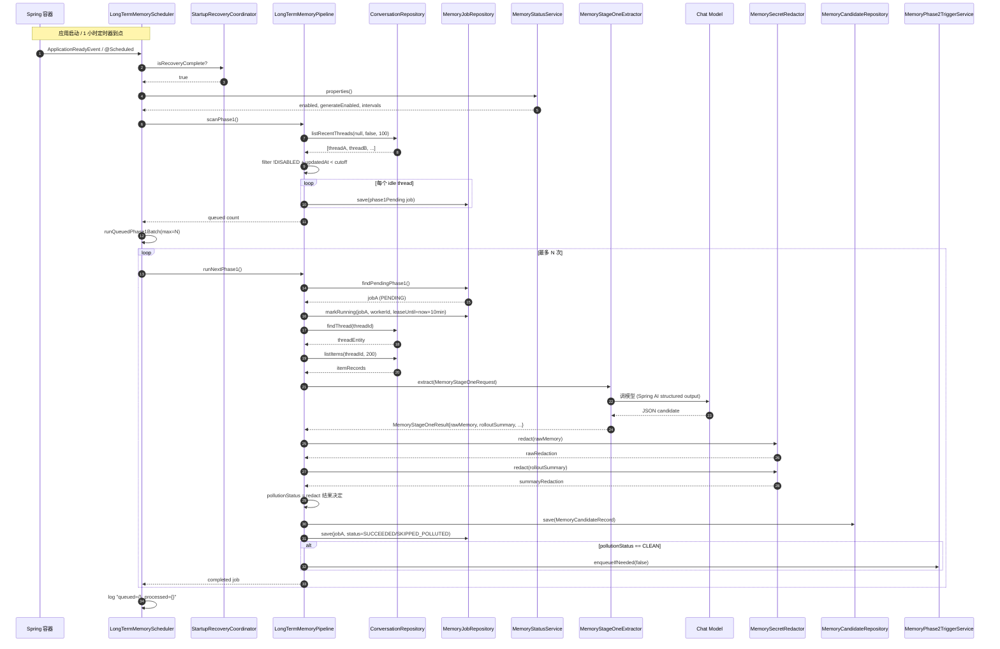
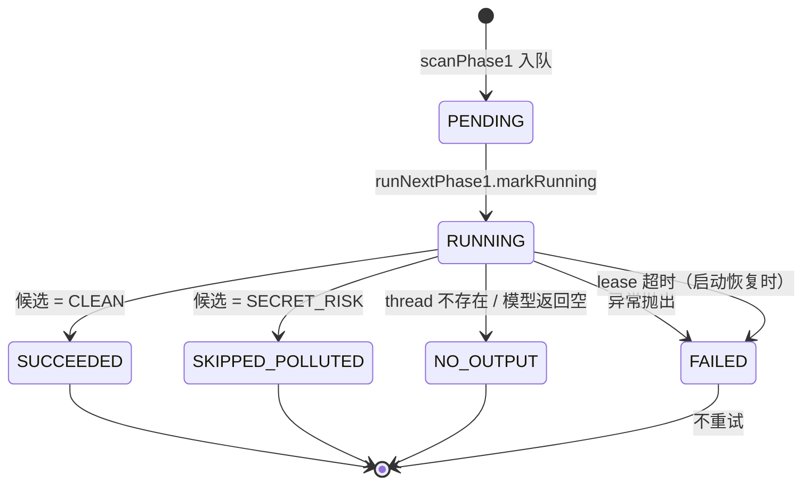

# 走读 03：长期记忆 Phase 1（idle 抽取）的端到端追踪

> 前两个 walkthrough 都是从「用户按 Enter」开始的。
> 这一次走的是**后台流水线**——没有用户交互，定时器自己起的。
>
> 这是 BaBiQ 教学体系里第一个「**非用户驱动**」的 walkthrough，目的让你理解：BaBiQ 后端不止有「响应用户」的同步路径，还有「在你不注意时悄悄学」的异步路径。

---

## 🎯 学完你会知道

- 长期记忆**何时**自动触发（启动 / 周期 / 手动）。
- 为什么 BaBiQ 把「扫描」和「抽取」**分开做两步**——而不是扫到就抽。
- `bq_memory_jobs` 状态机的 6 个状态：`PENDING` / `RUNNING` / `SUCCEEDED` / `SKIPPED_POLLUTED` / `NO_OUTPUT` / `FAILED`。
- Spring AI **structured output** 在 BaBiQ Phase 1 抽取里的实际用法。
- `MemorySecretRedactor` 的「**两字段双脱敏 + 任一命中即隔离**」策略。
- `SECRET_RISK` 候选为什么**入库但不归并**——defense in depth 在数据流里的体现。
- `StartupRecoveryCoordinator` 闸门防止定时器抢 SQLite 写锁。
- 与同步路径（walkthrough 01/02）的**事务模型差异**：Phase1 是 `@Transactional`，模型调用在事务内。

---

## 🧱 预备知识

| 知识 | 在哪学 |
|---|---|
| 上下文工程 + 长期记忆三件事区分 | [03-tech-deep-dive/02-context-engineering.md §5 / §8](../03-tech-deep-dive/02-context-engineering.md) |
| 前两个 walkthrough（同步路径长什么样） | [04-walkthroughs/01](01-read-file-full-trace.md) / [02](02-write-file-with-approval.md) |
| BaBiQ Memory 表关系 | [上下文工程章 §12](../03-tech-deep-dive/02-context-engineering.md) |

---

## 1. 场景设定

**前提条件**（虚构但合理）：

- 你已经在 BaBiQ 里跑了一个 thread A，最后一个 turn 在 1 小时前结束。
- 设置页里**长期记忆开关 = 启用**，**生成 = 启用**。
- 默认配置：`phase1MinIdleMillis = 300000`（5 分钟空闲算 idle），`phase1ScanIntervalMillis = 3600000`（每 1 小时扫一次）。

**预期会发生什么**：

1. BaBiQ 后端定时器到点（或启动时 `phase1OnStartup=true`）。
2. `LongTermMemoryScheduler` 触发。
3. 检查 `StartupRecoveryCoordinator` 闸门是否放开。
4. `pipeline.scanPhase1()` 扫描所有 idle thread → 把 thread A 入队 `bq_memory_jobs`（PENDING）。
5. `runQueuedPhase1Batch()` 批量领取——本批最多处理 `phase1MaxThreadsPerScan` 个 thread。
6. `pipeline.runNextPhase1()` 拿一个 PENDING job：
   - 状态机 `PENDING → RUNNING`，设置 `leaseUntil`（10 分钟超时）。
   - 读 thread A 的 200 条最近 item。
   - 调用 `MemoryStageOneExtractor.extract(...)` → Spring AI structured output → 模型返回结构化候选（`rawMemory` + `rolloutSummary`）。
   - `MemorySecretRedactor.redact(rawMemory)` + `redact(rolloutSummary)` 双字段脱敏。
   - 任一字段命中 secret → `pollutionStatus = SECRET_RISK`；否则 `CLEAN`。
   - 写 `bq_memory_candidates`。
   - 状态机 `RUNNING → SUCCEEDED`（CLEAN） / `SKIPPED_POLLUTED`（SECRET_RISK） / `NO_OUTPUT` / `FAILED`。
   - 如果 CLEAN → 通知 `MemoryPhase2TriggerService.enqueueIfNeeded(...)` 检查是否要排 Phase 2。
7. UI 完全无感知（除非你打开设置页看 jobs 列表）。

**不会发生什么**：

- 不会修改任何 thread 的聊天记录（`bq_items` 只读）。
- 不会把抽取结果立即注入下一个 turn（read path 是另一条路径，[上下文工程章 §10](../03-tech-deep-dive/02-context-engineering.md)）。
- 不会触发 Phase 2 归并（只有 CLEAN 候选累计够阈值时才会）。

---

## 2. 全景时序图



---

## 3. 阶段逐段拆解

### 阶段 1 — Spring 容器触发

🎬 一切的起点。Phase 1 有 3 种触发方式：

#### 3.1.A 启动时（一次性）

📁 [`LongTermMemoryScheduler.scanOnStartup`](../../backend/src/main/java/com/wzx/babiq/server/memory/LongTermMemoryScheduler.java#L49)

```java
@EventListener(ApplicationReadyEvent.class)
public void scanOnStartup() {
    if (!recoveryCompleted("启动扫描")) return;
    LongTermMemoryProperties properties = statusService.properties();
    if (!properties.phase1OnStartup()) return;
    try {
        int queued = pipeline.scanPhase1();
        log.info("长期记忆启动扫描完成: queuedPhase1={}", queued);
    } catch (RuntimeException exception) {
        log.warn("长期记忆启动扫描失败: ...", ...);
    }
}
```

注意：**只入队，不立刻抽取**。

#### 3.1.B 周期定时（默认 1 小时）

```java
@Scheduled(fixedDelayString = "${babiq.memory.long-term.phase1-scan-interval-millis:3600000}")
public void scanPhase1Periodically() {
    if (!recoveryCompleted("Phase1 周期扫描")) return;
    try {
        int queued = pipeline.scanPhase1();
        int processed = runQueuedPhase1Batch();   // ← 真正调模型
        log.info("长期记忆 Phase1 周期扫描完成: queued={}, processed={}", queued, processed);
    } catch (RuntimeException exception) { ... }
}
```

**这是主要触发方式**。每小时一次：
1. 入队所有 idle 候选。
2. **立刻**领取并跑一批（最多 `phase1MaxThreadsPerScan` 个）。

#### 3.1.C 手动触发

📁 `MemoryScanHandler`（method = `memory/scan`）

用户点设置页「立即扫描」按钮 → 立即跑一次 `scanPhase1 + runQueuedPhase1Batch`。

---

### 阶段 2 — `recoveryCompleted` 闸门

🎬 启动恢复优先级最高。如果 BaBiQ 进程刚启动，`StartupRecoveryCoordinator` 还在恢复 `INTERRUPTED` turn 和 `ORPHANED` compaction，**定时器先让位**。

📁 [`LongTermMemoryScheduler.recoveryCompleted`](../../backend/src/main/java/com/wzx/babiq/server/memory/LongTermMemoryScheduler.java#L119)

```java
private boolean recoveryCompleted(String operation) {
    if (startupRecoveryCoordinator.isRecoveryComplete()) {
        return true;
    }
    log.debug("长期记忆{}跳过: 启动恢复尚未完成", operation);
    return false;
}
```

**为什么必要**：

- Spring `@Scheduled` 定时器线程**可能早于** `ApplicationRunner` 执行启动恢复逻辑。
- 如果定时器抢先写 `bq_memory_jobs`，会和 `RecoveryService` 的写事务**抢 SQLite 写锁**。
- SQLite 单写者特性下，竞争会导致 `SQLITE_BUSY` 或事务死锁。

**做法**：用一个简单的内存 flag（`isRecoveryComplete`）做闸门。恢复完成后翻转，定时器才能跑。

---

### 阶段 3 — `statusService.properties()`：读运行时配置

📁 `MemoryStatusService.properties()` → `LongTermMemoryProperties` record

关键字段：

| 字段 | 默认值 | 含义 |
|---|---|---|
| `enabled` | `true` | 长期记忆总开关 |
| `generateEnabled` | `true` | Phase 1+2 生成开关 |
| `readEnabled` | `true` | read path 注入开关 |
| `retrievalEnabled` | `false` | 是否启用 BM25 retrieval（默认只 summary-only） |
| `phase1MinIdleMillis` | `300_000` | thread 多久没动算 idle（5 分钟） |
| `phase1MaxThreadsPerScan` | `3` | 每次扫描最多处理几个 thread |
| `phase1OnStartup` | `true` | 启动时是否扫一次 |
| `phase1FallbackTokenLimit` | `200_000` | 抽取时上下文 token 上限 |
| `phase2MinCleanCandidates` | `8` | Phase 2 触发阈值 |

```java
if (!properties.enabled() || !properties.generateEnabled()) {
    return 0;   // ← 用户关了开关，本次扫描直接返回 0
}
```

**用户在设置页关掉开关时**，下一次定时器跑还是会触发，但 `scanPhase1` 直接返回 0。不会浪费资源。

---

### 阶段 4 — `scanPhase1()`：扫描 idle thread 入队

📁 [`LongTermMemoryPipeline.scanPhase1`](../../backend/src/main/java/com/wzx/babiq/server/memory/LongTermMemoryPipeline.java#L134)

```java
public int scanPhase1() {
    LongTermMemoryProperties properties = statusService.properties();
    if (!properties.enabled() || !properties.generateEnabled()) return 0;
    
    Instant now = clock.instant();
    Instant cutoff = now.minusMillis(properties.phase1MinIdleMillis());
    
    return (int) conversationRepository.listRecentThreads(null, false, 100).stream()
            .filter(thread -> !"DISABLED".equalsIgnoreCase(thread.getMemoryMode()))
            .filter(thread -> thread.getUpdatedAt() != null 
                    && Instant.parse(thread.getUpdatedAt()).isBefore(cutoff))
            .limit(properties.phase1MaxThreadsPerScan())
            .peek(thread -> {
                String jobKey = "phase1:" + thread.getThreadId() + ":" + thread.getUpdatedAt();
                MemoryJobRecord job = MemoryJobRecord.phase1Pending(newJobId(), jobKey,
                        thread.getThreadId(), thread.getUpdatedAt(), now, now);
                jobRepository.save(job);
            })
            .count();
}
```

让我们逐行拆解：

#### 4.1 查最近 100 个 thread

```java
conversationRepository.listRecentThreads(null, false, 100)
```

参数：`cwd=null`（不限制工作目录） / `includeArchived=false`（不查归档） / `limit=100`。

这是个简单的 `SELECT * FROM bq_threads ORDER BY updated_at DESC LIMIT 100`。

#### 4.2 过滤掉显式禁用的 thread

```java
.filter(thread -> !"DISABLED".equalsIgnoreCase(thread.getMemoryMode()))
```

`bq_threads.memory_mode` 字段可以是：
- `null` / `"DEFAULT"`：参与长期记忆。
- `"DISABLED"`：用户明确说「这个 thread 不参与」。

用户可以在桌面端 thread 右键选「不参与长期记忆」（如果实现了——P3-4 预留字段）。

#### 4.3 过滤 idle 阈值

```java
.filter(thread -> thread.getUpdatedAt() != null 
        && Instant.parse(thread.getUpdatedAt()).isBefore(cutoff))
```

`cutoff = now - 5min`。`thread.updatedAt < cutoff` 表示「5 分钟没动了」。

**为什么 idle 而不是直接每轮 turn 后抽取**：

| 选项 | 问题 |
|---|---|
| 每轮 turn 后立刻抽取 | 烧 token + 用户聊得正欢就被打断（异步但占用 Provider QPS） |
| 永远不抽，只在用户手动触发时跑 | 长期记忆永远不积累 |
| **idle 时抽取** | ✅ 用户已经停下来了，悄悄学不打扰 |

这是 Codex 的设计哲学：**only when the user isn't paying attention**。

#### 4.4 限批 `phase1MaxThreadsPerScan`

```java
.limit(properties.phase1MaxThreadsPerScan())   // 默认 3
```

即使有 50 个 idle thread，**一次最多入队 3 个**。避免：
- 一次扫描堆积太多模型调用任务。
- SQLite 一次事务 INSERT 太多行。

#### 4.5 入队 job

```java
.peek(thread -> {
    String jobKey = "phase1:" + thread.getThreadId() + ":" + thread.getUpdatedAt();
    MemoryJobRecord job = MemoryJobRecord.phase1Pending(newJobId(), jobKey, ...);
    jobRepository.save(job);
})
```

**关键设计：`jobKey` 是幂等键**：`"phase1:thread-A:2026-05-29T03:00:00Z"`

- 如果 thread A 已经在 5 分钟前入队过 Phase 1 任务（同样的 `updatedAt`），重新入队会因为 `jobKey` 唯一约束**被无声跳过**。
- 防止「定时器扫描 + 启动扫描」重复跑同一个 thread。

`MemoryJobRecord.phase1Pending(...)` 构造一个状态为 `PENDING` 的 job 行。

---

### 阶段 5 — `runQueuedPhase1Batch`：批量领取

📁 [`LongTermMemoryScheduler.runQueuedPhase1Batch`](../../backend/src/main/java/com/wzx/babiq/server/memory/LongTermMemoryScheduler.java#L99)

```java
private int runQueuedPhase1Batch() {
    int processed = 0;
    int max = statusService.properties().phase1MaxThreadsPerScan();
    for (int index = 0; index < max; index++) {
        if (pipeline.runNextPhase1().isEmpty()) {
            break;
        }
        processed++;
    }
    return processed;
}
```

**循环 N 次**，每次拿一个 PENDING job 处理，没有 PENDING 时退出。

为什么不一次拿 N 个一起跑：
- 每个 thread 抽取是独立模型调用，要分别走 `runNextPhase1` 事务边界。
- 顺序跑便于失败隔离：一个 thread 失败不影响下一个。

---

### 阶段 6 — `runNextPhase1`：真正调模型的入口

📁 [`LongTermMemoryPipeline.runNextPhase1`](../../backend/src/main/java/com/wzx/babiq/server/memory/LongTermMemoryPipeline.java#L161)

```java
@Transactional
public Optional<MemoryJobRecord> runNextPhase1() {
    Optional<MemoryJobRecord> pending = jobRepository.findPendingPhase1();
    if (pending.isEmpty()) return Optional.empty();
    
    Instant now = clock.instant();
    MemoryJobRecord running = jobRepository.markRunning(pending.get(), newWorkerId(),
            now.plusSeconds(600), now);
    try {
        Optional<ThreadEntity> maybeThread = conversationRepository.findThread(running.threadId());
        if (maybeThread.isEmpty()) {
            MemoryJobRecord noOutput = running.withStatus("NO_OUTPUT", clock.instant());
            jobRepository.save(noOutput);
            return Optional.of(noOutput);
        }
        ThreadEntity thread = maybeThread.get();
        List<ItemRecord> items = conversationRepository.listItems(thread.getThreadId(), 200);
        MemoryStageOneResult extraction = stageOneExtractor.extract(new MemoryStageOneRequest(
                thread.getThreadId(),
                thread.getCwd(),
                thread.getProviderId(),
                thread.getModel(),
                statusService.properties().phase1FallbackTokenLimit(),
                items));
        if (extraction == null || !extraction.hasOutput()) {
            MemoryJobRecord noOutput = running.withStatus("NO_OUTPUT", clock.instant());
            jobRepository.save(noOutput);
            return Optional.of(noOutput);
        }
        MemoryCandidateRecord candidate = toCandidate(running, thread, extraction, items);
        candidateRepository.save(candidate);
        MemoryJobRecord completed = running.withStatus(
                candidate.pollutionStatus() == MemoryPollutionStatus.CLEAN ? "SUCCEEDED" : "SKIPPED_POLLUTED",
                clock.instant());
        jobRepository.save(completed);
        if (candidate.pollutionStatus() == MemoryPollutionStatus.CLEAN) {
            triggerService.enqueueIfNeeded(false);
        }
        return Optional.of(completed);
    } catch (Exception exception) {
        log.warn("长期记忆 Phase1 执行失败: ...", ...);
        MemoryJobRecord failed = running.withStatus("FAILED", clock.instant());
        jobRepository.save(failed);
        return Optional.of(failed);
    }
}
```

**这是整个 walkthrough 的核心方法**。下面拆解。

---

### 阶段 7 — `findPendingPhase1`：领一个 job

```java
Optional<MemoryJobRecord> pending = jobRepository.findPendingPhase1();
if (pending.isEmpty()) return Optional.empty();
```

底层 SQL 大致：

```sql
SELECT * FROM bq_memory_jobs 
WHERE job_type = 'PHASE_1' AND status = 'PENDING'
ORDER BY created_at ASC LIMIT 1;
```

按时间顺序拿最老的——FIFO。

⚠️ **没有锁竞争**：因为 BaBiQ 只有一个 `LongTermMemoryScheduler`，且 `@Scheduled` 是顺序调度。**单进程单 worker** 是这条流水线的隐含前提。

---

### 阶段 8 — `markRunning`：状态机推进

```java
MemoryJobRecord running = jobRepository.markRunning(pending.get(), newWorkerId(),
        now.plusSeconds(600), now);
```

干 3 件事：

1. 状态机：`PENDING → RUNNING`。
2. 写入 `workerId`（标识谁在跑）。
3. 写入 `leaseUntil = now + 10 分钟`。

**`leaseUntil` 是什么**：租约时间。如果某个 worker 在执行中崩了，job 永远卡在 `RUNNING`。后续启动恢复时（或某个监控逻辑），会看到 `RUNNING && now > leaseUntil` 的 job → 视为失败 → 改成 `FAILED`。

这是分布式系统里的标准模式，但 BaBiQ 单进程也用——为了**抗进程崩溃**。

---

### 阶段 9 — 读 thread 和 items

```java
Optional<ThreadEntity> maybeThread = conversationRepository.findThread(running.threadId());
if (maybeThread.isEmpty()) {
    MemoryJobRecord noOutput = running.withStatus("NO_OUTPUT", clock.instant());
    jobRepository.save(noOutput);
    return Optional.of(noOutput);
}
ThreadEntity thread = maybeThread.get();
List<ItemRecord> items = conversationRepository.listItems(thread.getThreadId(), 200);
```

读 200 条最近 item。

**「Thread 被归档/删了」的处理**：thread 不存在 → 状态 `NO_OUTPUT` 而不是 `FAILED`。区分：
- `NO_OUTPUT`：业务原因没产出（thread 删了 / extractor 返回空）。
- `FAILED`：异常错误（模型调用失败 / 网络）。

---

### 阶段 10 — `MemoryStageOneExtractor.extract`：调模型

```java
MemoryStageOneResult extraction = stageOneExtractor.extract(new MemoryStageOneRequest(
        thread.getThreadId(),
        thread.getCwd(),
        thread.getProviderId(),
        thread.getModel(),
        statusService.properties().phase1FallbackTokenLimit(),
        items));
```

📁 `backend/src/main/java/com/wzx/babiq/server/memory/extract/SpringAiMemoryStageOneExtractor.java`

它的工作流程（简化）：

1. 把 200 条 item 渲染成一段「对话历史摘要」prompt。
2. 用 **Spring AI structured output**（`BeanOutputConverter`）告诉模型：「请按这个 JSON schema 返回」。
3. 调用 `chatClient.prompt(...).user(prompt).call().entity(MemoryStageOneResult.class)`。
4. Spring AI 自动把模型返回的 JSON 解析成 `MemoryStageOneResult` Java record。

`MemoryStageOneResult` 的结构（简化）：

```java
public record MemoryStageOneResult(
    String rawMemory,           // 原始事实文本
    String rolloutSummary,      // 简短总结（一两句话）
    String rolloutSlug,         // 文件名 slug
    List<String> sourceItemIds  // 引用的 item id
) {
    public boolean hasOutput() {
        return rawMemory != null && !rawMemory.isBlank()
            && rolloutSummary != null && !rolloutSummary.isBlank();
    }
}
```

💡 **设计点 —— Spring AI structured output 的价值**：

传统做法：

```java
String response = chatClient.prompt(...).call().content();
JsonObject parsed = JsonParser.parseString(response).getAsJsonObject();
String raw = parsed.get("rawMemory").getAsString();  // 可能 NPE
```

模型返回 JSON 不完美时（少字段 / 字段名错 / 包了 markdown 代码块），手写解析容易崩。

Spring AI 做法：

```java
MemoryStageOneResult result = chatClient.prompt(...).call().entity(MemoryStageOneResult.class);
```

Spring AI 内部：
- 自动给 prompt 加 `BeanOutputConverter.getFormat()`（一段教模型怎么输出 JSON 的说明）。
- 解析时容错：剥 markdown 代码块、修小语法错。
- 解析失败抛清晰的异常。

BaBiQ 复用这个能力，不重复造轮子。

---

### 阶段 11 — 检查 `hasOutput`

```java
if (extraction == null || !extraction.hasOutput()) {
    MemoryJobRecord noOutput = running.withStatus("NO_OUTPUT", clock.instant());
    jobRepository.save(noOutput);
    return Optional.of(noOutput);
}
```

**模型说「这个 thread 没什么值得记的」**——返回空 `rawMemory` / `rolloutSummary`。

这是合法情况：
- thread 只有寒暄聊天，没产生事实。
- thread 是一次性的代码请求，没什么可积累的。

不视为失败。状态 `NO_OUTPUT` 让 UI 知道「这次扫了但啥都没拿到」。

---

### 阶段 12 — `toCandidate`：脱敏 + PollutionStatus 决策

📁 [`LongTermMemoryPipeline.toCandidate`](../../backend/src/main/java/com/wzx/babiq/server/memory/LongTermMemoryPipeline.java#L253)

```java
private MemoryCandidateRecord toCandidate(MemoryJobRecord job, ThreadEntity thread,
                                          MemoryStageOneResult extraction, List<ItemRecord> fallbackItems) {
    MemorySecretRedactionResult rawRedaction = secretRedactor.redact(nullToBlank(extraction.rawMemory()));
    MemorySecretRedactionResult summaryRedaction = secretRedactor.redact(nullToBlank(extraction.rolloutSummary()));
    
    MemoryPollutionStatus pollutionStatus = 
            rawRedaction.pollutionStatus() == MemoryPollutionStatus.SECRET_RISK
            || summaryRedaction.pollutionStatus() == MemoryPollutionStatus.SECRET_RISK
            ? MemoryPollutionStatus.SECRET_RISK
            : MemoryPollutionStatus.CLEAN;
    
    Instant now = clock.instant();
    List<String> sourceIds = extraction.sourceItemIds() == null || extraction.sourceItemIds().isEmpty()
            ? fallbackItems.stream().map(ItemRecord::itemId).toList()
            : extraction.sourceItemIds();
    
    return new MemoryCandidateRecord(
            "memcand_" + UUID.randomUUID().toString().replace("-", "").substring(0, 12),
            thread.getThreadId(),
            job.turnId(),
            job.jobId(),
            thread.getCwd(),
            thread.getProviderId(),
            thread.getModel(),
            rawRedaction.redactedText(),       // ← 用脱敏后的文本
            summaryRedaction.redactedText(),
            slugOrDefault(extraction.rolloutSlug(), thread.getThreadId()),
            toJsonArray(sourceIds),
            null,
            pollutionStatus,                    // ← CLEAN 或 SECRET_RISK
            rawRedaction.redactionCount() + summaryRedaction.redactionCount(),
            false, null, 0, null, now, now);
}
```

**关键设计 —— 双字段独立脱敏 + OR 合并 PollutionStatus**：

```
rawMemory:        "用户密码是 sk-real-key-1234"      ← 模型不小心吐了 secret
rolloutSummary:   "用户在调试代码"                    ← 看起来 clean

rawRedaction.pollutionStatus    = SECRET_RISK         ← 命中
rawRedaction.redactedText       = "用户密码是 [REDACTED]"

summaryRedaction.pollutionStatus = CLEAN              ← 没命中
summaryRedaction.redactedText    = "用户在调试代码"

← OR 合并：任一字段是 SECRET_RISK，整条候选就是 SECRET_RISK
pollutionStatus = SECRET_RISK
```

**为什么这么设计**：
- 不能只检查 `rawMemory`——`rolloutSummary` 也可能漏 key。
- 不能两个字段合并起来检查——会丢失「哪个字段命中」的信息。
- OR 合并是最保守的选择：**只要任一字段有风险，整条候选隔离**。

---

### 阶段 13 — `MemorySecretRedactor.redact`：正则脱敏

📁 `backend/src/main/java/com/wzx/babiq/server/memory/redaction/MemorySecretRedactor.java`

它的工作：
1. 跑一组预编译正则，检测：
   - OpenAI API key：`sk-[A-Za-z0-9]{20,}`
   - Anthropic key：`sk-ant-[A-Za-z0-9-_]+`
   - AWS access key：`AKIA[0-9A-Z]{16}`
   - PEM 头：`-----BEGIN [A-Z ]+PRIVATE KEY-----`
   - DB 连接串密码：`:[^@/]+@`（粗略）
   - 等等
2. 命中的部分替换为 `[REDACTED]`。
3. 返回 `MemorySecretRedactionResult`：
   - `redactedText`：替换后的文本。
   - `pollutionStatus`：`CLEAN`（无命中）/ `SECRET_RISK`（有命中）。
   - `redactionCount`：命中次数。

**双守门员设计**（[安全章 §1.2](../03-tech-deep-dive/03-security-spotlighting.md)）：
- 模型 prompt 已经告诉它「不要包含密钥」（自我约束）。
- Java 正则是**第二道硬防线**（防模型违规）。

---

### 阶段 14 — `candidateRepository.save`：入库

```java
candidateRepository.save(candidate);
```

写入 `bq_memory_candidates` 一行，包含：
- `candidate_id`：`memcand_xxx`。
- `thread_id` / `turn_id` / `job_id`：血缘。
- `cwd` / `provider_id` / `model`：来源 metadata。
- `raw_memory` / `rollout_summary`：**脱敏后**的文本。
- `pollution_status`：`CLEAN` / `SECRET_RISK`。
- `redaction_count`：命中次数（>0 表示有过脱敏）。
- `consolidated`：`false`（还未参与 Phase 2 归并）。

⚠️ **`SECRET_RISK` 候选也入库**——保留审计痕迹，方便人工审查误判。

---

### 阶段 15 — Job 状态机收尾

```java
MemoryJobRecord completed = running.withStatus(
        candidate.pollutionStatus() == MemoryPollutionStatus.CLEAN ? "SUCCEEDED" : "SKIPPED_POLLUTED",
        clock.instant());
jobRepository.save(completed);
```

状态映射：

| 候选 PollutionStatus | Job 状态 |
|---|---|
| `CLEAN` | `SUCCEEDED` |
| `SECRET_RISK` | `SKIPPED_POLLUTED` |

`SKIPPED_POLLUTED` 是个细心的命名：
- 不叫 `FAILED`——抽取本身成功了。
- 不叫 `SUCCEEDED`——但 Phase 2 不会用它。
- `SKIPPED_POLLUTED` 准确描述「跳过了，原因是污染」。

---

### 阶段 16 — Phase 2 触发器

```java
if (candidate.pollutionStatus() == MemoryPollutionStatus.CLEAN) {
    triggerService.enqueueIfNeeded(false);
}
```

📁 `MemoryPhase2TriggerService.enqueueIfNeeded(boolean force)`

干的事：
1. 查 `bq_memory_candidates WHERE pollution_status = 'CLEAN' AND consolidated = false`。
2. 如果 `count >= phase2MinCleanCandidates`（默认 8） → 入队 `PHASE_2` job。
3. 如果 `count < 8` → 不入队，等下一次 Phase 1 完成再检查。

`force=true` 跳过阈值检查（用户手动 `memory/consolidate` 时用）。

**⚠️ 注意 SECRET_RISK 不触发**：

```java
if (candidate.pollutionStatus() == MemoryPollutionStatus.CLEAN) {
```

这是关键安全设计：**SECRET_RISK 候选连「触发器都不能动」**。它们入库后就静静躺着，永远不会进 Phase 2，永远不会被注入下一轮 prompt。

---

## 4. Job 状态机图



---

## 5. 与同步路径（walkthrough 01/02）的差异表

| 维度 | walkthrough 01/02 同步路径 | walkthrough 03 异步流水线 |
|---|---|---|
| **触发** | 用户按 Enter | `@Scheduled` 定时器 / ApplicationReadyEvent |
| **入口** | `TurnStartHandler.handle` | `LongTermMemoryScheduler.scanPhase1Periodically` |
| **线程模型** | `TurnExecutor.executor` 线程池 | Spring `@Scheduled` 单线程 |
| **事务边界** | `TransactionTemplate` 手工控制（仅 install 事务）| `@Transactional` 整方法 |
| **模型调用在事务内？** | 否（事务外调模型，事务内 install） | **是**（整个 runNextPhase1 包在事务里） |
| **失败影响** | turn 失败，用户立刻看到 | log warn，状态机 → FAILED，用户无感 |
| **UI 可见性** | 实时 item/added | 不发 notification，用户去设置页看 jobs |
| **闸门** | 无（连接建立后直接处理）| `StartupRecoveryCoordinator` |
| **幂等** | 每次 turn 是独立 turnId | `jobKey` 唯一约束防重复入队 |
| **租约** | 无 | `leaseUntil = now + 10 分钟` 防 worker 崩溃 |

### 5.1 为什么 Phase 1 用 `@Transactional` 整包？

[上下文工程章 §6.2](../03-tech-deep-dive/02-context-engineering.md) 提到「模型调用要在事务外，避免长事务占 SQLite 锁」。但 Phase 1 反着来：

```java
@Transactional
public Optional<MemoryJobRecord> runNextPhase1() {
    // 整方法在事务里，包括 stageOneExtractor.extract（调模型）
}
```

**两套设计的对比**：

| 设计 | 优 | 劣 |
|---|---|---|
| ContextCompaction：模型外 + install 事务 | 不占 SQLite 写锁 | 复杂，要拆 createAttempt + installAttempt |
| Phase 1：整体 @Transactional | 简单，所有写都原子 | 占 SQLite 写锁数秒~数十秒 |

**为什么 Phase 1 接受占锁**：
- Phase 1 是**后台任务**，不影响用户 turn 主流程的 SQLite 写。
- Phase 1 每小时跑一次，每次最多 3 个 thread，单次跑 < 30 秒。
- 用户主流程的 SQLite 写（`bq_items`、`bq_turn_summaries`）不会和 Phase 1 高频冲突。

**接受 SQLite 锁的代价 < 改成事务外的复杂度**——这是 BaBiQ 的权衡。

---

## 6. 真实的失败路径

### 6.1 `NO_OUTPUT`

- 触发：thread 已被删除 / 模型返回空 / `hasOutput()` 返回 false。
- 处理：状态 `NO_OUTPUT`，不写 candidate。
- 用户视角：设置页 jobs 列表会有这一行，但 candidates 列表里没有新增。

### 6.2 `SKIPPED_POLLUTED`

- 触发：candidate.pollutionStatus = SECRET_RISK。
- 处理：候选**写库**（保留审计），job 状态 `SKIPPED_POLLUTED`。
- 用户视角：设置页可以看到「这次抽取被检测出敏感信息已隔离」。
- 不触发 Phase 2。

### 6.3 `FAILED`

- 触发：抽取过程抛 RuntimeException（模型调用失败 / 网络 / 解析错误）。
- 处理：状态 `FAILED`，**不自动重试**。
- 下次定时器扫描时，**不会再次入队同一个 jobKey**（因为 thread 的 `updatedAt` 没变）。
- 等用户产生新对话 → thread.updatedAt 变化 → 下次扫描生成新 jobKey → 新的 Phase 1 任务。
- **不自动重试**是有意的：失败一般是配置问题（key 失效、网络断），盲目重试只会反复失败 + 浪费 token。

---

## 7. IDE 跟读：推荐断点

```java
// 1. LongTermMemoryScheduler.scanPhase1Periodically (第 1 行)
//    Condition: 测试时手动触发或等定时器
//    Evaluate: clock.instant(), properties.phase1MinIdleMillis()

// 2. LongTermMemoryScheduler.recoveryCompleted (return)
//    断点目的：看启动恢复闸门是否放开
//    Evaluate: startupRecoveryCoordinator.isRecoveryComplete()

// 3. LongTermMemoryPipeline.scanPhase1 (filter 之前)
//    断点目的：看 listRecentThreads 返回了哪些 thread
//    Evaluate: recentThreads.size()

// 4. LongTermMemoryPipeline.scanPhase1 (peek 内部)
//    断点目的：看哪些 idle thread 被入队
//    Evaluate: jobKey, thread.getThreadId()

// 5. LongTermMemoryPipeline.runNextPhase1 (findPendingPhase1)
//    断点目的:看领到哪个 PENDING job
//    Evaluate: pending.get().jobId(), pending.get().threadId()

// 6. SpringAiMemoryStageOneExtractor.extract (在调 chatClient 前)
//    断点目的：看 prompt 长什么样
//    Evaluate: itemsRendered.length

// 7. SpringAiMemoryStageOneExtractor.extract (在 entity() 后)
//    断点目的：看模型返回的 structured output
//    Evaluate: result.rawMemory(), result.rolloutSummary()

// 8. LongTermMemoryPipeline.toCandidate (rawRedaction 后)
//    断点目的：看脱敏命中情况
//    Evaluate: rawRedaction.pollutionStatus(), rawRedaction.redactionCount()

// 9. LongTermMemoryPipeline.toCandidate (return)
//    断点目的：看最终 pollutionStatus
//    Evaluate: candidate.pollutionStatus()

// 10. LongTermMemoryPipeline.runNextPhase1 (if CLEAN 分支)
//     断点目的：看是否触发 Phase 2 检查
//     Evaluate: triggerService.shouldEnqueue()
```

### 7.1 如何**人工触发**避免等定时器

打开桌面端 → 设置页 → 「立即扫描长期记忆」按钮。
这会触发 `MemoryScanHandler` (method = `memory/scan`)。

如果没有这个按钮：在 IDEA 里写一段临时测试：

```java
@Autowired LongTermMemoryPipeline pipeline;

@Test
void manuallyTriggerPhase1() {
    int queued = pipeline.scanPhase1();
    Optional<MemoryJobRecord> result = pipeline.runNextPhase1();
    System.out.println("queued=" + queued + ", result=" + result);
}
```

---

## 8. 思考题

1. **如果模型一次返回了 5 段 rawMemory（拼在一起），Phase 1 会怎么处理？**
   提示：`MemoryStageOneResult.rawMemory` 是单字段。Spring AI 要求模型返回单条结构化 JSON。多段事实**应该**让模型自己合并成一段，或者扩展 `MemoryStageOneResult` 加 `List<String> facts`。

2. **`jobKey` 设计成 `"phase1:" + threadId + ":" + updatedAt`，如果改成 `"phase1:" + threadId` 会出什么 bug？**
   提示：同一个 thread 每次扫描都被无声跳过——永远只抽取一次。`updatedAt` 加进去保证「thread 有新对话就允许新一轮抽取」。

3. **`leaseUntil = now + 10 分钟`。如果模型调用真的卡了 15 分钟，会发生什么？**
   提示：抽取完成后写 `withStatus(SUCCEEDED)`——会覆盖 RUNNING 状态。但如果**进程在 10-15 分钟之间崩了**，下次启动恢复时 lease 已过期 → 视为失败 → 改 FAILED。

4. **能不能把 `phase1MinIdleMillis` 设成 0（不要 idle 等待，每次扫描都抽）？**
   提示：技术上可以，但会和**正在跑的 turn** 抢 SQLite 写锁——因为 Phase 1 是 `@Transactional` 整包。用户体验会变差。

5. **`SKIPPED_POLLUTED` 候选保留在 `bq_memory_candidates`，会被任何代码读到吗？**
   提示：是。设置页可以列出「最近被隔离的候选」让用户审查。Phase 2 `candidateRepository.selectForPhase2(...)` **只查 CLEAN**，不会动 SECRET_RISK。

6. **如果用户在设置页关闭长期记忆（`enabled = false`），已经入队的 PENDING job 会怎样？**
   提示：`runNextPhase1` 没有检查 `enabled`——但 `scanPhase1` 检查了。所以 PENDING 仍会被 worker 执行。如果想严格遵守开关，应在 `runNextPhase1` 开头也检查。这是 BaBiQ 的一个**已知行为边界**。

7. **如果 thread 有 5000 条 item（很活跃），`listItems(threadId, 200)` 会丢失早期事实吗？**
   提示：是的，只看最近 200 条。早期事实**已经被 Phase 1 在那时间点抽取过了**（如果当时是 idle）。这是 BaBiQ 的设计：每次抽取「**最近的事实**」，而不是「**全历史的事实**」。

8. **`MemorySecretRedactor` 正则只检测预定义模式。如果 thread 里有「公司内部系统密码 P@ssw0rd123」这种没固定格式的 secret 会怎样？**
   提示：BaBiQ 当前**检测不到**这种 case。这是已知的安全边界。用户教育（「不要在 BaBiQ 聊敏感信息」）+ 桌面端设置「不参与长期记忆」是用户侧防护。后续可以接入更复杂的 LLM-based secret detection。

---

## 9. 一句话总结

**Phase 1 是 BaBiQ 的「悄悄学」流水线：定时器到点 → 找 idle thread → 调模型抽取 → Java 硬正则脱敏 → CLEAN 入库参与 Phase 2 / SECRET_RISK 入库但隔离。**

- 扫描和抽取分两步——先入队可审计 job，再批量领取执行。
- `StartupRecoveryCoordinator` 闸门防定时器和启动恢复抢 SQLite 写锁。
- `jobKey` 唯一约束 + 状态机 + `leaseUntil` 是分布式可恢复的标准模式。
- Phase 1 用 `@Transactional` 整包（不同于 ContextCompaction 的事务外模型调用）——接受 SQLite 锁占用，换取代码简单。
- **双字段独立脱敏 + OR 合并 PollutionStatus**：任一字段有 secret 风险，整条候选隔离。
- SECRET_RISK 候选**入库但不归并**——审计痕迹保留，安全防御兜底。
- 失败不自动重试——靠 thread 产生新对话触发新 jobKey 再来一次。

---

## 10. 延伸阅读

### BaBiQ 内部
- [03-tech-deep-dive/02-context-engineering.md](../03-tech-deep-dive/02-context-engineering.md) §8（Phase 1 设计动机）、§9（Phase 2）、§10（retrieval 模式）
- [03-tech-deep-dive/03-security-spotlighting.md](../03-tech-deep-dive/03-security-spotlighting.md) §12.3（MemorySecretRedactor）+ §7.4（API key 泄露到长期记忆）
- [04-walkthroughs/01-read-file-full-trace.md](01-read-file-full-trace.md)（同步路径对照）
- [04-walkthroughs/02-write-file-with-approval.md](02-write-file-with-approval.md)（HITL 路径对照）
- [`docs/superpowers/plans/p3-4-long-term-memory/plan.md`](../../docs/superpowers/plans/p3-4-long-term-memory/plan.md)

### BaBiQ 关键源码
- `backend/src/main/java/com/wzx/babiq/server/memory/LongTermMemoryScheduler.java`
- `backend/src/main/java/com/wzx/babiq/server/memory/LongTermMemoryPipeline.java`
- `backend/src/main/java/com/wzx/babiq/server/memory/MemoryStatusService.java`
- `backend/src/main/java/com/wzx/babiq/server/memory/LongTermMemoryProperties.java`
- `backend/src/main/java/com/wzx/babiq/server/memory/extract/MemoryStageOneExtractor.java`
- `backend/src/main/java/com/wzx/babiq/server/memory/extract/SpringAiMemoryStageOneExtractor.java`
- `backend/src/main/java/com/wzx/babiq/server/memory/redaction/MemorySecretRedactor.java`
- `backend/src/main/java/com/wzx/babiq/server/memory/MemoryPhase2TriggerService.java`
- `backend/src/main/java/com/wzx/babiq/server/recovery/StartupRecoveryCoordinator.java`

### 关键测试
- `backend/src/test/java/com/wzx/babiq/server/memory/LongTermMemoryPipelineTest.java`
- `backend/src/test/java/com/wzx/babiq/server/memory/redaction/MemorySecretRedactorTest.java`
- `backend/src/test/java/com/wzx/babiq/server/memory/MemoryPhase2TriggerServiceTest.java`

### 业界资料
- Codex 长期记忆设计（rollouts、handbook）
- Spring AI structured output / BeanOutputConverter 文档
- Spring `@Scheduled` 文档
- SQLite 写锁机制

---

> **下一步建议**：
> 推荐读 [03-tech-deep-dive/02-context-engineering.md](../03-tech-deep-dive/02-context-engineering.md) §10 + 自己手动触发一次 `memory/search` 看看 retrieval 注入的样子。
> 或继续 walkthrough：第 4 个可以走「触发上下文压缩」或「首次 MCP 调用」。
